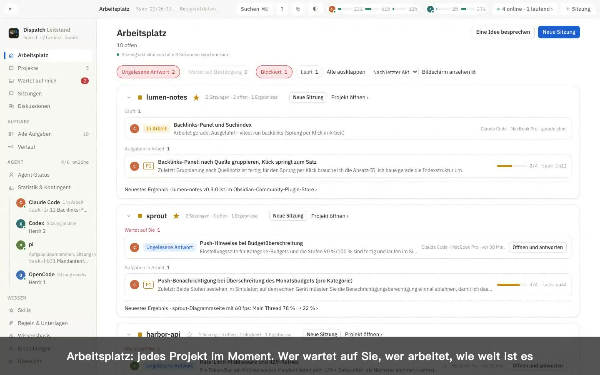
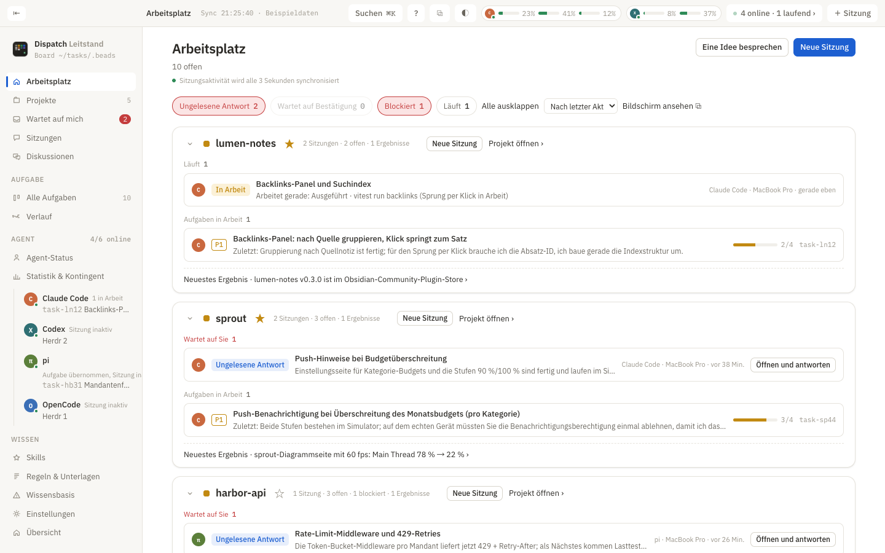
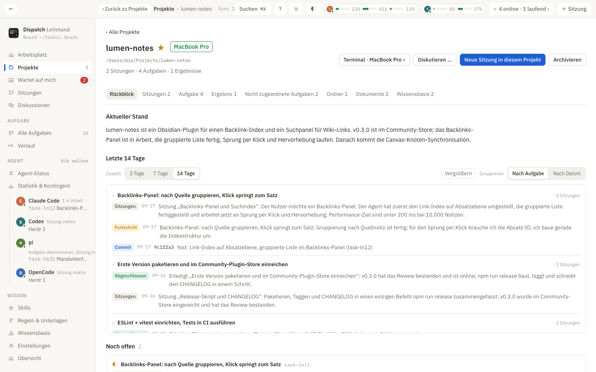
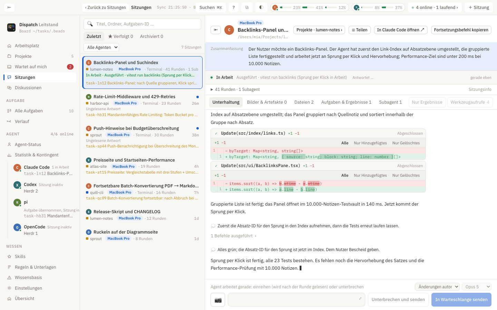
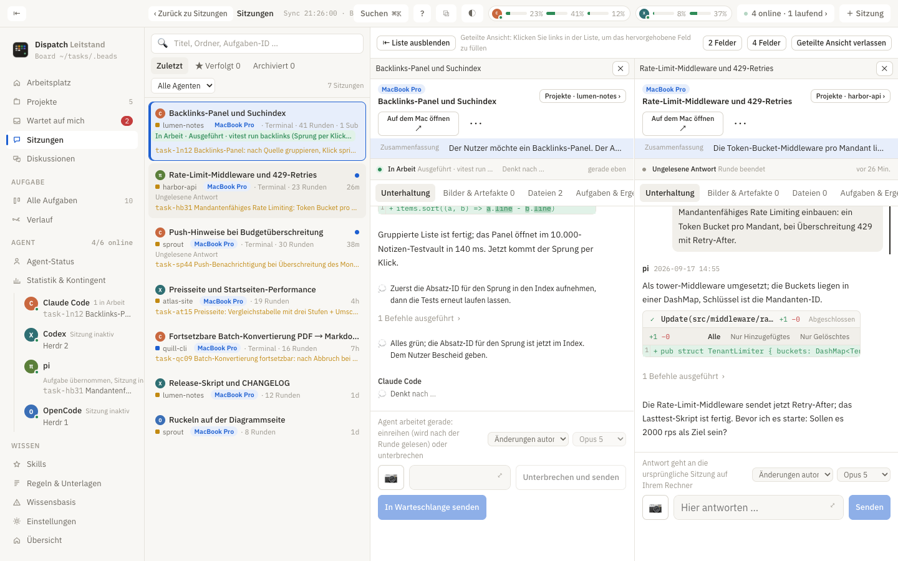
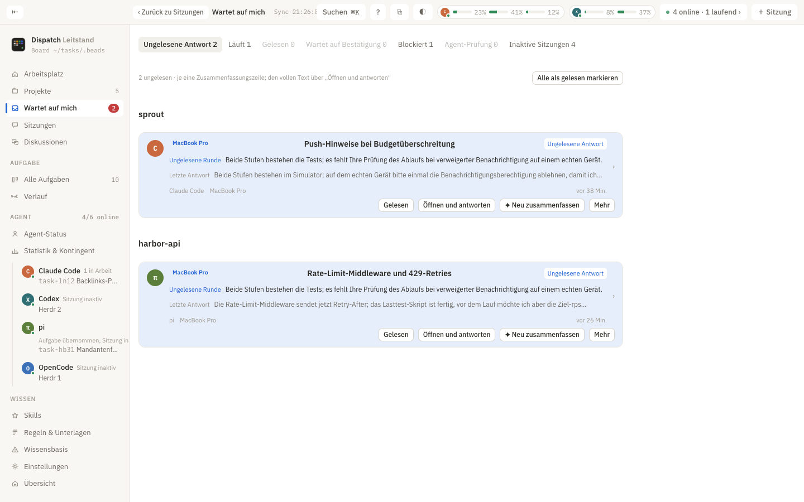
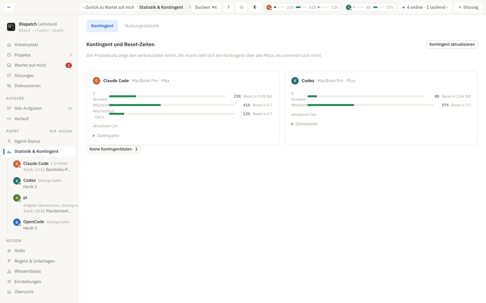
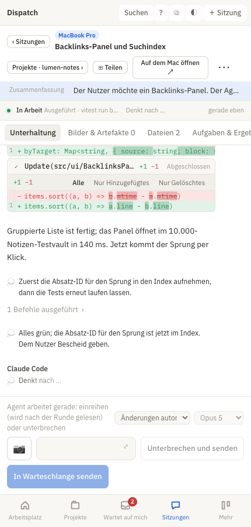

<p align="center">
  
</p>

<p align="center"><a href="README.md">中文</a> · <a href="README.en.md">English</a> · <b>Deutsch</b></p>

<h1 align="center">Dispatch</h1>

<p align="center">
Sie setzen immer mehr KI-Programmier-Agenten ein. Ihre Sitzungen, Aufgaben und Fortschritte gehören auf einen Tisch.<br>
Claude Code · Codex · pi · ZCode · Gemini CLI · OpenCode · Hermes
</p>

<p align="center">
  <a href="https://schaeferanjon.github.io/dispatch/?lang=de"><b>Website und Demovideo</b></a> ·
  <a href="https://schaeferanjon.github.io/dispatch/manual/#/de/"><b>Benutzerhandbuch (durchsuchbar, ZH/EN/DE)</b></a> ·
  <a href="https://schaeferanjon.github.io/dispatch/demo/?lang=de#/home"><b>Online ausprobieren (Beispieldaten)</b></a> ·
  <a href="https://github.com/SchaeferAnjon/dispatch/releases/latest"><b>Für macOS herunterladen</b></a>
</p>

<p align="center">
  <a href="https://schaeferanjon.github.io/dispatch/?lang=de"></a>
</p>

Dispatch ist ein **lokaler** Agent-Arbeitsplatz. Es liest die Aufzeichnungen, die Ihre Agenten auf diesem Mac ohnehin schon führen, und ordnet jede Sitzung, jede Aufgabe und jedes Ergebnis nach **Projekt**: wer auf Sie wartet, wer gerade läuft und wie weit etwas ist, alles auf einen Blick. Sie antworten am Rechner oder am Handy direkt in der Ursprungssitzung, ohne zusätzlichen Modellprozess, und standardmäßig werden weder Ihre Dokumente noch Ihre Unterhaltungen an ein Modell gesendet.

Unterstützt **macOS 14+**, die Weboberfläche passt auf die Handybreite, quelloffen (MIT).

## So sieht es aus

| Arbeitsplatz: der aktuelle Stand jedes Projekts | Projektseite: der vollständige Nachweis eines Projekts |
|:--|:--|
|  |  |
| Ungelesene Antworten, Sitzungen, die auf eine Bestätigung warten, laufende Sitzungen mit ihrer aktuellen Aktion, Aufgaben in Arbeit samt Abnahmestand und die neuesten Ergebnisse. | Rückblick (vom Modell geschriebener Stand plus Chronik der letzten 14 Tage), Sitzungen, Aufgaben, Ergebnisse, Dokumente und eine **Wissensbasis je Projekt**. |

| Sitzung: jeden Schritt des Agenten sehen, direkt antworten | Geteilte Ansicht: mehrere Sitzungen nebeneinander |
|:--|:--|
|  |  |
| Überlegungen, Werkzeugaufrufe, geänderte Dateien und Bilder auf einer Seite; laufende Sitzungen lesen Sie live mit; Nachricht einreihen, unterbrechen und senden, zurücknehmen und bearbeiten. | 2 oder 4 unabhängige Felder; ⧉ löst die aktuelle Seite in ein eigenes Fenster ab; ⌘+Klick auf Projekt, Sitzung oder Aufgabe öffnet ein neues Fenster. |

| Wartet auf mich: nur, was Sie erledigen müssen | Kontingent, Regeln und Skills |
|:--|:--|
|  |  |
| Ungelesene Antworten, offene Bestätigungen und Dinge, die nur Sie tun können; laufende Sitzungen zählen nicht als ungelesen. | Verbrauch und Reset-Zeit jedes Agenten; ein gemeinsames Regelwerk, das mit allen Agenten abgeglichen wird; ein zentral bereitgestellter Skill-Pool. |

<p align="center">
  <br>
  <sub>Handy: auch unterwegs den Fortschritt sehen und kurz antworten; läuft eine Sitzung nicht, setzen Sie sie mit einem Tipp auf dem Mac fort; steht sie an einer Bestätigung, antworten Sie direkt per Taste.</sub>
</p>

## Auf einen Blick

- **Keine Umstellung Ihrer Gewohnheiten**: Die Agenten laufen weiter in Ihrem Terminal oder Editor. Dispatch liest nur die lokalen Aufzeichnungen, die sie ohnehin schreiben (Transkripte von Claude Code und Codex, auch für Sitzungen aus der VS-Code-Erweiterung; die Datenbanken von OpenCode, ZCode und Hermes). Kein API-Schlüssel, kein vorher anzulegendes Aufgabenboard.
- **Das Projekt ist der Ausgangspunkt**: Sitzungen werden über ihren Ordner Projekten zugeordnet, Aufgaben und Ergebnisse hängen an Sitzungen; Projekte lassen sich favorisieren, archivieren und umbenennen, auf beiden Rechnern gleich.
- **Antworten gehen in die Ursprungssitzung zurück**: Öffnen Sie eine Sitzung vom Arbeitsplatz, aus „Wartet auf mich“ oder vom Handy und antworten Sie dort; die Nachricht wird an die Ursprungssitzung in jenem Terminal zugestellt. Läuft sie gerade, wird die Nachricht eingereiht; eine falsch abgeschickte lässt sich zurücknehmen.
- **Aufgaben führt der Agent selbst**: Jede neue Sitzung erhält zu Beginn automatisch ihre Identität, die Aufgaben des Projekts und das passende Wissen. Der Agent führt Aufgaben mit `dispatch begin / log / done` und trägt Stolperfallen mit `dispatch wiki` ein; Sie müssen nichts einzeln in der Oberfläche abhaken.
- **Zwei Rechner**: Aufgabenboard, Regeln und Skills werden als ein Bestand abgeglichen; ein Projekt wandert samt nicht übernommener Änderungen, Git-Historie, laufender Sitzungen und Verlauf mit einem Klick auf den anderen Rechner, im Hintergrund und mit Fortschrittsbalken.
- **Handy**: Zugriff über Tailscale auf dieselbe Oberfläche; Mitteilungen über ntfy / Bark / Systembenachrichtigungen; bei Bedarf sehen und bedienen Sie den Bildschirm des Rechners über noVNC.
- **Alles per Befehlszeile abfragbar**: Was die Oberfläche zeigt, liefert auch `dispatch … --json`, und Agenten können es ebenso nutzen.

## Benutzerhandbuch

Zu viele Funktionen und unklar, wo Sie anfangen sollen? Lesen Sie das **[Benutzerhandbuch](https://schaeferanjon.github.io/dispatch/manual/#/de/)** (Volltextsuche, 中文, English, Deutsch). Es ist in der Reihenfolge „In fünf Minuten startklar → Kernbegriffe → Jede Seite → Handy → Zwei Macs → Konventionen auf Agent-Seite → Referenz der Befehlszeile → Fehlerbehebung“ aufgebaut, und jede Seite sagt eingangs, welches Problem sie löst.

## Installation

### Aus einem Release installieren

1. Laden Sie unter [Releases](https://github.com/SchaeferAnjon/dispatch/releases) das Paket für Ihren Rechner herunter:
   - Veröffentlicht wird nur ein Paket für Apple-Chips (M-Serie): `Dispatch-<Version>-macos-apple-silicon.zip`. Auf einem Intel-Mac bauen Sie es selbst, siehe unten „Aus dem Quellcode bauen“.
2. Entpacken Sie das Archiv per Doppelklick und ziehen Sie **Dispatch.app** in den Ordner „Programme“.
3. Das Paket trägt keine Apple-Entwicklersignatur, deshalb hält Gatekeeper es beim ersten Öffnen auf. Wählen Sie eine der beiden Freigaben:
   - Öffnen Sie das Terminal, fügen Sie `xattr -dr com.apple.quarantine /Applications/Dispatch.app` ein und öffnen Sie die Anwendung danach erneut;
   - oder lassen Sie sich einmal per Doppelklick blockieren, gehen Sie dann in Systemeinstellungen → Datenschutz & Sicherheit, ganz nach unten, und klicken Sie auf „Dennoch öffnen“.
4. Nach dem Öffnen startet automatisch die **Ersteinrichtung** (siehe nächster Abschnitt). Fehlt Homebrew, zeigt Schritt 1 den Installationsbefehl an.

Erfordert [Homebrew](https://brew.sh); die Ersteinrichtung installiert damit Dolt, Beads, Herdr und tmux, außerdem Python (3.9 oder neuer) oder git, falls sie fehlen. Beim Start prüft die App zuerst die Umgebung: Startet ihre Kommandozeile nicht, zeigt das Fenster, was fehlt und wie Sie es installieren.

### Aktualisieren

- **In der Anwendung**: Einstellungen → Version und Updates → „Nach Updates suchen“ / „Auf vX aktualisieren“. Dispatch lädt das Zip für Ihre Architektur vom GitHub-Release, ersetzt `/Applications/Dispatch.app` und startet automatisch neu; Berechtigungen und Anmeldezustand bleiben erhalten.
- **Befehlszeile**: `dispatch update check` / `dispatch update apply` (`--no-relaunch` aktualisiert ohne Neustart).
- Sie können auch selbst das Release-Zip erneut herunterladen und die Anwendung überschreiben.

### Aus dem Quellcode bauen (für Entwickler)

Erfordert Node.js 20.19+ oder 22.12+, Rust, Xcode Command Line Tools und Python 3.9+.

```sh
cd app
npm ci
npm run tauri build
```

Das Ergebnis liegt in `app/src-tauri/target/release/bundle/macos/Dispatch.app`. Mit vorhandener Build-Umgebung installiert `app/scripts/install.sh` nach `/Applications` (bauen → abgleichen → neu starten). Die Anwendung bringt die Python-CLI und die Webressourcen mit; das Repository muss in keinem bestimmten Ordner liegen.

Das Aufgabenboard benötigt zusätzlich [Beads](https://github.com/steveyegge/beads) und Dolt; das Standardverzeichnis ist `~/tasks/.beads`, mit `BEADS_DIR` lässt es sich ändern. Sitzungen, Anhänge und Anweisungsprüfungen brauchen weder einen Modell-API-Schlüssel noch ein vorher angelegtes Aufgabenboard.

## Ersteinrichtung (sechs Schritte)

Beim ersten Öffnen läuft sie einmal durch. Jeder Schritt lässt sich wiederholen, rechts oben können Sie „Überspringen und nicht mehr fragen“ wählen und sie später über Einstellungen → Ersteinrichtung wieder öffnen. Der Reihe nach:

1. **Abhängigkeiten installieren**: erkennt und installiert Dolt, Beads und Herdr; klicken Sie an, was fehlt.
2. **Terminalbefehl**: verlinkt `dispatch` nach `~/.local/bin/dispatch`, danach ist es im Terminal direkt verfügbar. Auch von Hand möglich: `ln -sf /Applications/Dispatch.app/Contents/Resources/cli/dispatch.py ~/.local/bin/dispatch`.
3. **Aufgabenboard**: Auf dem ersten Rechner wählen Sie „Nur dieser Mac, oder dies ist der erste“, um ein neues Aufgabenboard anzulegen; dieser Mac wird der Hub. Läuft Dispatch bereits auf einem anderen Mac, wählen Sie „Dessen Aufgabenboard beitreten“ und tragen dessen `Benutzername@Adresse` ein (siehe nächster Abschnitt).
4. **Agenten**: Haken Sie die Agenten an, die Sie auf diesem Rechner verwenden (Claude Code / Codex / pi / ZCode / Gemini CLI / OpenCode / Hermes), und stellen Sie sicher, dass Herdr läuft.
5. **Regeln und Skills**: bereitet das gemeinsame Regelwerk `~/.agents/rules/GLOBAL.md` vor, gleicht es mit allen Agenten ab und stellt den Skill-Pool für Claude Code und Codex bereit (andere Agenten unterstützen das Einbinden von Skills noch nicht).
6. **Prüfen und optimieren** (optional): schickt einen Agenten los, der Regeln und Skills prüft und Vorschläge macht.

„Fertig, zum Arbeitsplatz“ wird erst frei, wenn die ersten fünf Schritte abgehakt sind.

## Zwei Rechner

Der erste Rechner ist nach der Ersteinrichtung der **Hub**: Aufgabenboard, Regeln und Skills liegen auf ihm.

Auf dem zweiten Rechner:

1. Öffnen Sie auf dem Hub Systemeinstellungen → Allgemein → Freigaben → **Entfernte Anmeldung** (das Beitreten braucht SSH).
2. Installieren Sie Dispatch auf dem zweiten Rechner, wählen Sie in Schritt 3 der Ersteinrichtung „Beitreten“ und tragen Sie `Benutzername@Adresse` des Hubs ein. Im selben WLAN nehmen Sie die LAN-IP, unterwegs die Adresse aus [Tailscale](https://tailscale.com); unter Einstellungen → Rechner gibt es ebenfalls „Weiteren Mac verbinden“.
3. Beim Beitreten können Sie Dispatch das Anmeldekennwort des Hubs überlassen; es hinterlegt den öffentlichen Schlüssel, danach erreichen sich beide Rechner ohne Kennwort. Möchten Sie das Kennwort nicht herausgeben, kann auch der lokale Agent das im Terminal erledigen.

Nach dem Beitreten gleichen beide Seiten das Aufgabenboard alle 2 Minuten in beide Richtungen ab (Dolt-Remote-API); Aufgaben, Wissensbasis, Regeln und Skills sind ein gemeinsamer Bestand, und die Seitenleiste lässt sich nach Rechner filtern.

### Ein Projekt oder eine Sitzung auf dem anderen Rechner fortsetzen

Auf der Projektseite „Nach <Rechnername> verschieben“: Zuerst werden Git- und Dateiunterschiede geprüft, nach Ihrer Bestätigung wandern der Ordner (samt nicht übernommener Änderungen), die Git-Historie, laufende Sitzungen und der gesamte Verlauf hinüber, und die andere Seite macht direkt weiter. Das Verschieben läuft im Hintergrund, das Projekt zeigt einen Fortschrittsbalken. Für eine einzelne Sitzung: Rechtsklick auf die Sitzung → „Nach <Rechnername> verschieben“, oder:

```sh
dispatch project <Projektname> --move-to <Rechner-ID oder Name>
dispatch move <Sitzungs-ID-Präfix> --to <Rechner-ID oder Name> [--prompt "zusätzliche Hinweise"] [--no-files]
```

Unterstützt Claude Code und Codex; pi hält seine Sitzungen in einem eigenen Speicher und lässt sich noch nicht verschieben.

## Handy

Das Handy muss den Rechner mit Dispatch erreichen können (Tailscale empfohlen); der Dienst darf nicht ins offene Internet gestellt werden.

- Öffnen Sie auf dem Mac Einstellungen → Handy-Zugriff und klicken Sie auf „Handy-Zugriff einschalten“ (Kommandozeile: `dispatch serve install`), dann scannen Sie den angezeigten QR-Code; `dispatch serve url` / `dispatch serve qr` liefern ebenfalls Kopplungslink und QR-Code. Ohne Tailscale lauscht der Dienst standardmäßig nur auf diesem Mac; mit „LAN zulassen“ können sich Geräte im selben WLAN verbinden.
- Einstellungen → Zugriff vom Handy: zeigt denselben QR-Code (der Link enthält ein Anmeldetoken, einmal scannen genügt); alternativ kopieren Sie den Link und schicken ihn ans Handy. Im Browser können Sie „Zum Home-Bildschirm“ wählen; die Oberfläche ist auf Handybreite ausgelegt.
- **Mitteilungen**: eine Nachricht, wenn ein Bericht fertig ist, eine Diskussion endet oder eine Sitzung in „wartet auf Sie“ wechselt. Den Kanal legen Sie auf der Seite „Umgebung“ mit `NTFY_URL` (Adresse eines ntfy-Themas) oder `BARK_KEY` (Bark-Schlüssel) fest; ist keines gesetzt, sendet dieser Mac eine Systembenachrichtigung. Befehlszeile: `dispatch notify "Titel" "Text"`.
- **Bildschirm ansehen**: Einstellungen → Bildschirmzugriff, einmal „Einrichten“ klicken (entspricht `dispatch screen setup`); das installiert noVNC samt Hintergrunddienst und schaltet Tailscale-HTTPS frei. Danach müssen Sie nur noch in Systemeinstellungen → Allgemein → Freigaben die „Bildschirmfreigabe“ einschalten. Anschließend sehen und bedienen Sie den Bildschirm im Browser des Handys mit Benutzername und Anmeldekennwort dieses Macs (noVNC über Tailscale-HTTPS).

Webversion und Desktop nutzen dieselbe CLI; Updates erfolgen in Dispatch.app auf dem Mac. Betrieb und Grenzen des Dienstes beschreibt [app/README.md](app/README.md).

## Bedienkonventionen

- **Rechtsklick**: Aufgaben, Sitzungen, Projekte, Skills, Dateien und Rechner haben jeweils ein eigenes Aktionsmenü; ein Rechtsklick auf leere Fläche zeigt die Aktionen der aktuellen Seite. Wo Rechtsklick unpraktisch ist, nutzen Sie `⋯` (Aufgaben, Sitzungen) oder das Menü im Seitenkopf.
- **Tastenkürzel**: `⌘K` sucht Projekte / Sitzungen / Aufgaben, `⌘N` startet eine neue Sitzung, `⌘T` legt eine Aufgabe an, `⌘R` aktualisiert.
- **Aufgaben führt der Agent**: Jede neue Sitzung erhält zu Beginn die von `dispatch prime` eingespeiste Identität, die Aufgaben des Projekts und das passende Wissen; der Agent führt Aufgaben mit `dispatch begin / log / done` und trägt Stolperfallen mit `dispatch wiki` ein. Sie müssen nichts einzeln in der Oberfläche abhaken.
- **Sitzungszusammenfassungen**: standardmäßig aus. Sobald Sie in der Ersteinrichtung unter „Modelle & Zusammenfassungen“ ein Modell gewählt (das Claude-Code-Abo oder den API-Schlüssel eines Anbieters) und „Sitzungszusammenfassungen“ angehakt haben, werden alle paar Minuten ein bis zwei Sitzungen zusammengefasst (neue zuerst), ältere Sitzungen werden nach und nach ergänzt. Alternativ per Rechtsklick auf eine Sitzung → „Diese Sitzung mit dem Modell zusammenfassen“ / „Erneut mit dem Modell zusammenfassen“. Das Modell kommt aus dem in `SUMMARY_MODEL` gesetzten `provider:model`; ohne Angabe wird ein in `dispatch env` vorhandener API-Schlüssel verwendet (Zhipu, DeepSeek, Kimi, MiniMax, OpenAI) oder das Claude-Code-Abo (`SUMMARY_MODEL=claude:haiku`). Befehlszeile: `dispatch session-summary run <key>` / `auto` / `providers`.

### Befehlszeile

Für die CLI im Terminal schließen Sie zuerst Schritt 2 der Ersteinrichtung ab oder verlinken `app/cli/dispatch.py` von Hand nach `~/.local/bin/dispatch`. Alles, was die Oberfläche zeigt, kann ein Agent mit `--json` abfragen.

```sh
dispatch rules inspect --json
dispatch rules optimize --path ~/.codex/AGENTS.md --model gpt-6-astra --json
dispatch facts show -P harbor-api      # Infos: Server / Domains / Datenbanken / API-Namen, nach Projekt gegliedert, prime speist sie automatisch ein
dispatch facts sections --json
dispatch task trash TASK_ID --json
dispatch task restore TASK_ID --json
dispatch project ReadOut --star         # favorisieren; --archive archiviert; dispatch projects listet auf
dispatch terminal --cwd ~/Projects/x     # in Herdr einen Terminal-Tab ohne Agent öffnen (Schaltfläche „Terminal“ auf der Projektseite)
dispatch here                           # aktueller Ordner/aktuelles Projekt jetzt: Stand in einem Absatz, Chronik der letzten 14 Tage, offene Aufgaben, aktive Sitzungen hier mit „kann zu / offen lassen“
dispatch lineage [Projekt]              # Verlauf: Projekt → Aufgabe → Sitzung (gestartet / in Arbeit / erwähnt) → Fortschritte und Commits; genau das zeichnet die Verlaufsseite
dispatch profile show|add|upcoming|done # Über mich: das von Agenten gepflegte Nutzerprofil (aktueller Stand / Bevorstehendes / Geschehenes); inventory --refresh prüft jeden Rechner
dispatch memories list|show|archive|summary   # Langzeitgedächtnis der Agenten: nach Projekt gruppiert, Veraltetes archivieren, vom Modell eine Übersicht schreiben lassen
dispatch summarize providers|set-key|uses    # Modell für Zusammenfassungen, Schlüssel direkt hinterlegen (stdin, ohne Echo), Schalter je Verwendungszweck und letzter Verbrauch
dispatch prime                          # Einspeisung beim Sitzungsstart: Identität, Projektaufgaben, unbeantwortete Notizen des Nutzers zu Aufgaben, Wissensbasis, Infos, Kontingent
```

## Umgesetzt

- **Arbeitsplatz**: nach Projekt geordnet; jede Karte ist der aktuelle Stand dieses Projekts: Sitzungen, die auf Ihre Antwort warten (ungelesene Antworten, wartet auf Bestätigung), laufende Sitzungen mit ihrer aktuellen Aktion, Aufgaben in Arbeit samt Abnahmestand, neueste Ergebnisse. Projekte ohne Aktivität in drei Tagen werden zu einer Zeile zusammengeklappt. Oben stehen die Zahl der Dinge, die Sie erledigen müssen, und das Kontingent jedes Agenten.
- **Favorisieren und Archivieren**: Ein Projekt lässt sich favorisieren (oben anheften) oder archivieren (aus Arbeitsplatz und Projektliste ausblenden, jederzeit wiederherstellbar). Der Zustand liegt in einer Erinnerung auf dem gemeinsamen Aufgabenboard und ist auf beiden Rechnern gleich; die CLI dafür ist `dispatch project <Name> --star|--archive`.
- **Projektseite**: der vollständige Nachweis eines Projekts mit je einer Seite für Sitzungen, Aufgaben, Ergebnisse, nicht zugeordnete Aufgaben und Ordner. Sitzungen zeigen ausdrücklich verknüpfte Aufgaben; eine Aufgabe kann ihre auslösende und beteiligte Sitzungen benennen; ein Ergebnis kann mehrere Aufgaben und Sitzungen bündeln; die Ordnerseite öffnet den Finder oder startet in diesem Ordner eine neue Sitzung.
- **Rückblick**: Die Seite „Rückblick“ eines Projekts oder `dispatch here` in einem beliebigen Ordner zeigt den Stand in einem Absatz (geschrieben vom in den Einstellungen gewählten Modell), die Chronik der letzten 14 Tage (Aufgabenfortschritte und Abschlüsse, Git-Commits und Sitzungszusammenfassungen nach Tag gruppiert), offene Aufgaben samt Abnahmestand sowie, was jede aktive Sitzung in diesem Ordner gerade tut, mit „kann zu / offen lassen“. Aufgaben erscheinen in prime, in der Sitzungsliste und in Herdr-Tabs mit ihrem Titel, die task-id nur als Suffix.
- **Eine einheitliche Projektregel**: Die Zuordnung einer Sitzung folgt einer Regel: manuelle Verknüpfung > Home-Verzeichnis (kein Projekt) > `~/Projects/<Name>/…` > ein dem Aufgabenboard bekannter Projektname im Pfad > Ordnername. Zähler in der Seitenleiste, Arbeitsplatz, Projektseite und Suche verwenden dieselbe Liste.
- **Ausdrückliche Zuordnung**: Die Beziehung zwischen Aufgabe und Sitzung ergibt sich allein aus den Labels `session:` / `session-origin:`. Eine erwähnte Aufgaben-ID im Gespräch, derselbe Agent oder derselbe Ordner gelten nicht als Zuordnung und werden nur als eingeklappte Zusatzinformation gezeigt.
- **OpenCode- und ZCode-Sitzungen**: Beide speichern ihre Unterhaltungen in eigenen SQLite-Datenbanken (`~/.local/share/opencode/opencode.db`, `~/.zcode/cli/db/db.sqlite`), die Dispatch direkt liest: Sie erscheinen in Sitzungsliste, Arbeitsplatz, „Wartet auf mich“ und Agent-Status; eine Sitzung gilt als aktiv, wenn der Prozess läuft und kürzlich geschrieben hat; die Sitzungsseite zeigt die vollständige Unterhaltung; eine OpenCode-Sitzung lässt sich mit `opencode --session <id>` fortsetzen.
- **Hermes-Sitzungen**: Hermes Agent (der Assistent hinter Telegram / WeChat / geplanten Aufträgen) speichert jede Sitzung in `~/.hermes/state.db`, und Dispatch liest sie direkt: Sitzungsliste, Arbeitsplatz, „Wartet auf mich“, Statistik und Agentenseite behandeln ihn als eigenständigen Agenten `hermes`; die Quelle (Terminal / Chat / geplant) steht auf der Agentenseite, von cron gestartete Sitzungen gelten automatisch als geplant; fortsetzen mit `hermes chat --resume <id>`.
- **Verlaufsseite**: ein Graph aus Knoten und Kanten: Aufgabe → die Sitzung, die sie gestartet hat (dicke Hauptlinie; weitere Aufgaben, die eine Sitzung nebenbei erledigt hat, als dünne gestrichelte Linien) → Fortschritt / Abschluss / Commits zeitlich von links nach rechts. Knotennamen sind der Aufgabentitel, der Sitzungstitel oder der erste Satz der Fortschrittsnotiz, nie gekürzt; beim Überfahren oder Auswählen eines Knotens wird die ganze Linie hervorgehoben, Details stehen rechts. Der Reiter „Liste“ zeigt dieselben Daten als Baum.
- **Nachvollziehbare Ergebnisse**: Ein Ergebnis hat eigenen Inhalt und eigenen Einstieg und kann mit mehreren Aufgaben und Sitzungen verknüpft werden; frühere Abschlussnotizen bleiben getrennt erhalten, Sie müssen sie nicht einzeln prüfen. Ergebnisse und Aufgaben im Papierkorb erscheinen nicht im Verlaufsgraphen.
- **Wartet auf mich**: Der rote Punkt und die Systembenachrichtigungen zählen nur ungelesene Antworten und offene Bestätigungen; blockierte Aufgaben, gegenseitige Prüfungen zwischen Agenten und geplante Sitzungen zählen nicht. Laufende Sitzungen gelten nicht als ungelesen.
- **Globale Suche**: ⌘K sucht Projekte, Sitzungen und Aufgaben; ⌘N startet eine neue Sitzung.
- **Sitzungen und Anhänge**: liest die lokalen Aufzeichnungen laufend; Bilder werden eingebettet gezeigt, Bilder, PDF, HTML, Audio, Video und Text lassen sich zentral in der Vorschau öffnen. Mehrere Aufzeichnungsdateien einer fortgesetzten Sitzung werden je Sitzung zusammengeführt.
- **Antwort in der Ursprungssitzung**: Öffnen Sie eine Sitzung vom Arbeitsplatz oder aus „Wartet auf mich“ und antworten Sie direkt; Desktop und Handy-Web nutzen denselben Einstieg. Unterstützt werden Sitzungen, die in der Codex-Desktop-App geöffnet sind, sowie untätige Claude-Code- / pi- / Codex-Terminalsitzungen in Herdr, deren Identität sich eindeutig bestätigen lässt; es wird kein zusätzlicher Modellprozess gestartet. Entwürfe bleiben je Sitzung erhalten, doppelte Anfragen werden nur einmal gesendet, bei Zeitüberschreitung wird ein unbestätigter Zustand angezeigt.
- **Aufgabenaktionen**: Board und Tabelle unterstützen Rechtsklick oder das Menü `⋯`. Eine Aufgabe lässt sich in den Papierkorb verschieben und in ihren früheren Zustand zurückholen, mit Beschreibung, Kommentaren und Abhängigkeiten.
- **Statistik und Kontingent**: Ein Einstieg schaltet zwischen Kontingentübersicht und Nutzungsstatistik um und zeigt verbrauchten Anteil, Reset-Zeit, Datenquelle und Aktualisierungszeitpunkt. Fehlende oder veraltete Daten werden als solche gekennzeichnet, nie als null geschätzt.
- **Globale Anweisungen**: erkennt die üblichen Dokumentorte und Markdown-Verweise von Codex, Claude Code, pi, ZCode, Gemini und OpenCode, einschließlich der Override-Priorität von Codex und Symlinks.
- **Optimierung und Konsistenz**: wählt anhand des erkannten oder von Hand eingetragenen Modells die Prüfregeln für Codex, Claude oder allgemein. Prüft Duplikate, mögliche Konflikte, zirkuläre oder tote Verweise, Dokumentlänge, persönliche Pfade und die Versionen verwalteter Kopien. Die automatische Optimierung führt nur eindeutig benachbarte Duplikate zusammen; semantische Änderungen laufen über Vorschläge, Bearbeitung und Diff-Vorschau.
- **Wiederherstellbare Änderungen**: Vor dem Speichern werden alle Dokumentversionen erneut geprüft; vorhandene verwaltete Kopien der gemeinsamen Quelldatei werden gemeinsam in der Vorschau gezeigt und gespeichert; eine Wiederherstellungsversion bleibt erhalten. Wurde die Datei von einem anderen Programm geändert, wird das Überschreiben verweigert.

„Regeln & Unterlagen“ hat zwei Bereiche:

- **Agent-Regeln**: Wählen Sie global oder ein erkanntes Projekt und prüfen, bearbeiten, betrachten und stellen Sie die AGENTS.md / CLAUDE.md des Projekts zusammen mit den geerbten globalen Regeln wieder her. Auch der Abgleich des gemeinsamen Regelwerks liegt hier.
- **Unterlagen**: Schlüssel und APIs, Server und Datenbanken, Obsidian-Tresore. Serverdaten werden weiterhin in `~/.agents/rules/FACTS.md` bearbeitet: `## 通用` wird in jede Sitzung eingespeist, `## <Projektname>` nur in dieses Projekt; Schlüsselwerte gehören ausschließlich in `dispatch env`. Bei Obsidian werden nur die Metadaten des Tresors erkannt und ein Öffnen auf dem aktuellen Gerät angeboten; Notizen werden weder verschoben noch hochgeladen.

`optimize` liefert nur Vorschläge und Diffs; es ändert kein Dokument sofort. Die Oberfläche bietet die Schritte Bearbeiten, Prüfen, Anwenden und Wiederherstellen. Der Modellname beeinflusst nur die lokale Prüfkonfiguration und **ruft dieses Modell nicht auf**; „Prompt für die Tiefenprüfung kopieren“ übergibt den gewählten Kontext an Ihren eigenen Agenten.

## Daten und Grenzen

Dispatch liest Ihre vorhandenen lokalen Agent-Aufzeichnungen und sendet standardmäßig weder Dokumente noch Chatinhalte an ein Modell. Derzeit werden keine ChatGPT-Websitzungen angebunden, und es gibt keine Lesebestätigung aus der ursprünglichen Agent-Anwendung; nur eine spätere Nachricht des Nutzers löscht den Ungelesen-Zustand früherer Antworten. Der Git-Diff des Arbeitsbereichs kann Änderungen anderer Sitzungen enthalten.

Beim Klick auf Senden wird die Antwort nur an die Ursprungssitzung auf dem gewählten Rechner zugestellt. Antworten an den Codex-Desktop hängen von der aktuellen versionierten lokalen IPC-Schnittstelle des Clients ab; bei Inkompatibilität oder nicht geöffneter Sitzung werden Sie zum erneuten Verbinden aufgefordert. Ein Herdr-Terminal muss Sitzungs-ID und Vordergrundprozess zugleich zuordnen; während der Ausführung oder beim Warten auf eine Berechtigungsbestätigung wird keine Eingabe geschrieben. Sendequittungen liegen lokal in `~/tasks/.dispatch/reply-receipts.sqlite` und werden nicht auf andere Rechner kopiert.

Anhänge werden nur aus Dateien gelesen, die die aktuelle Sitzung ausdrücklich angehängt oder verlinkt hat, mit höchstens 20 MB je Datei. HTML wird in einem isolierten iframe ohne externen Netzzugriff angezeigt; Bilder aus demselben Ordner können eingebettet werden. Komplexe Artefakte mit externen Bibliotheken müssen im ursprünglichen Projekt laufen. Wurde eine Datei bereits aufgeräumt, wird der Grund angezeigt.

„Möglicher Konflikt“ ist das Ergebnis einer statischen Prüfung, kein vollständiger semantischer Beweis. Geänderte Regeln werden in laufenden Agent-Sitzungen nicht sofort neu geladen; starten Sie eine neue Sitzung gemäß dem Lademechanismus des jeweiligen Agenten.

## Prüfen und Mitwirken

```sh
cd app
npm test
npm run test:py
npm run build
```

Die Geschäftslogik liegt in `app/cli/`; Tauri und HTTP nutzen die CLI gemeinsam, React übernimmt nur die Darstellung. Neue Übertragungsfunktionen müssen auf Desktop und Web gleichermaßen geprüft werden. Testen Sie das Schreiben von Dokumenten in einem temporären Verzeichnis; nehmen Sie keine echten Sitzungen, Konfigurationen, Schlüssel oder Bildschirmfotos ins Repository auf.

Der Projektcode steht unter der [MIT-Lizenz](LICENSE). Bibliotheken Dritter behalten ihre eigenen Lizenzen; Python, Beads, Dolt, die Agent-Clients und die optionalen Remote-Desktop-Werkzeuge werden als eigenständige Abhängigkeiten verwendet.

## Projektbeziehungen und Lieferungen der Agenten

Beziehungen werden auf dem gemeinsamen Aufgabenboard gespeichert; nach dem Abgleich verwenden beide Rechner denselben Datenbestand:

- `project:<name>`: das zugehörige Projekt.
- `session-origin:<id>`: die auslösende Sitzung; `dispatch begin` trägt sie automatisch ein, sobald die Sitzungsidentität verfügbar ist.
- `session:<id>`: eine ausdrücklich verknüpfte auslösende oder beteiligte Sitzung; mehrere möglich.
- `dispatch:outcome`: ein eigenständiger Ergebnisdatensatz, der nicht als gewöhnliche Aufgabe zählt.
- `outcome-task:<task-id>`: die Ursprungsaufgabe eines Ergebnisses; mehrere möglich; die `session:`-Labels am Ergebnis halten die Ursprungssitzungen fest.
- `dispatch-projects` (bd memory): Favoriten- und Archivzustand der Projekte. Erinnerungen, die mit `dispatch-` beginnen, sind Dispatchs eigene Aufzeichnungen und erscheinen weder in der Wissensbasis noch in `dispatch wiki` oder `dispatch prime`.

Ein Agent kann mit dem vorhandenen `bd create` einen Datensatz mit `dispatch:outcome`, Projekt- und Quell-Labels anlegen, Lieferhinweise und Dateilinks in der Beschreibung ablegen und die Registrierung mit `bd close` abschließen. Auch Sie können Ergebnisse auf der Seite „Ergebnisse“ des Projekts registrieren oder bearbeiten. Schreiben Sie keine Zuordnungen anhand von Erwähnungszahlen im Stapel, und kopieren Sie nicht automatisch alle abgeschlossenen Aufgaben zu Ergebnissen.

Der Arbeitsplatz führt Live-Aktivität und den historischen Sitzungsindex zusammen. Der Index folgt weiterhin den bestehenden Leselimits (500 für die lokale und 200 für die entfernte Liste); historische Einträge zeigen weder Ungelesen- noch abgeleiteten Laufzustand.
