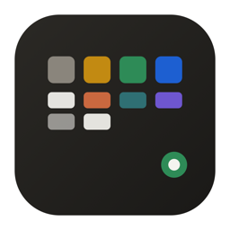
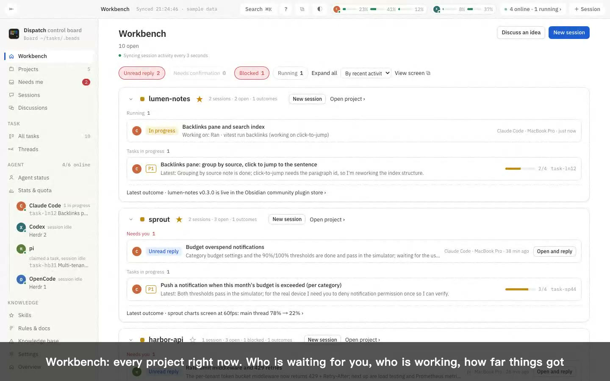
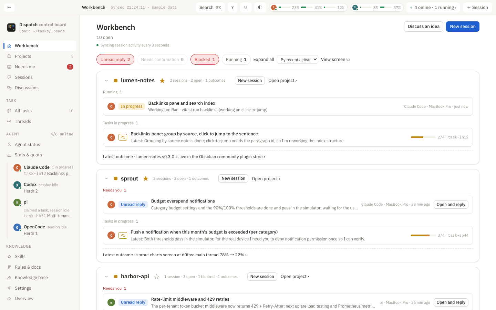
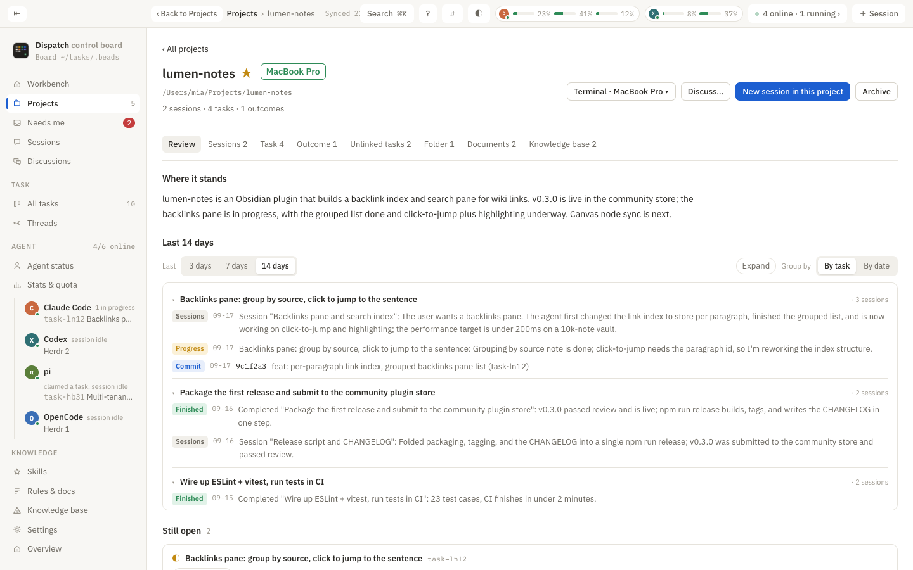
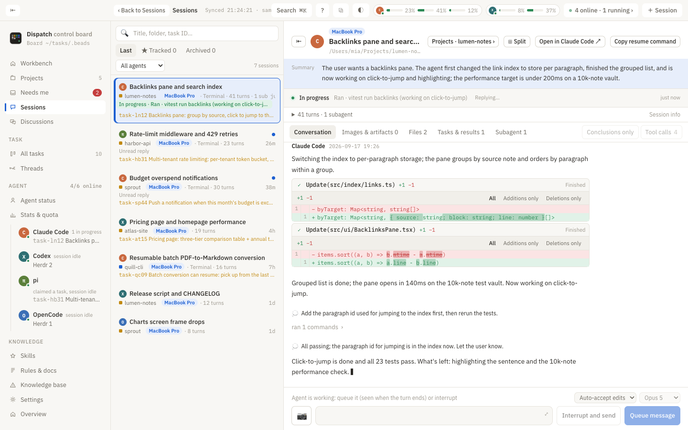
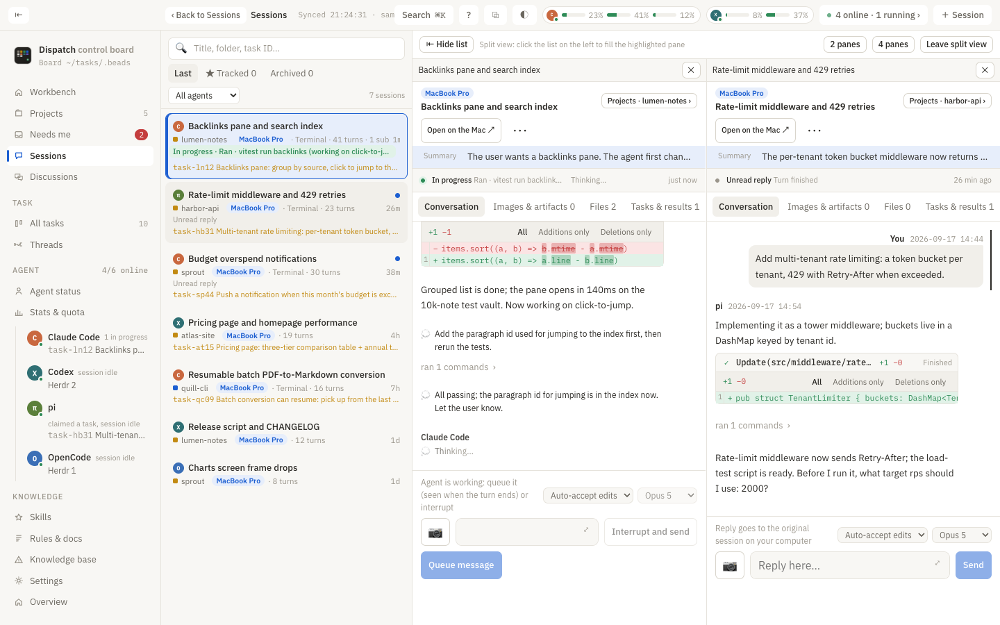
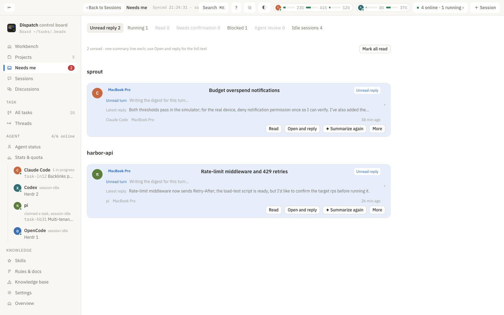
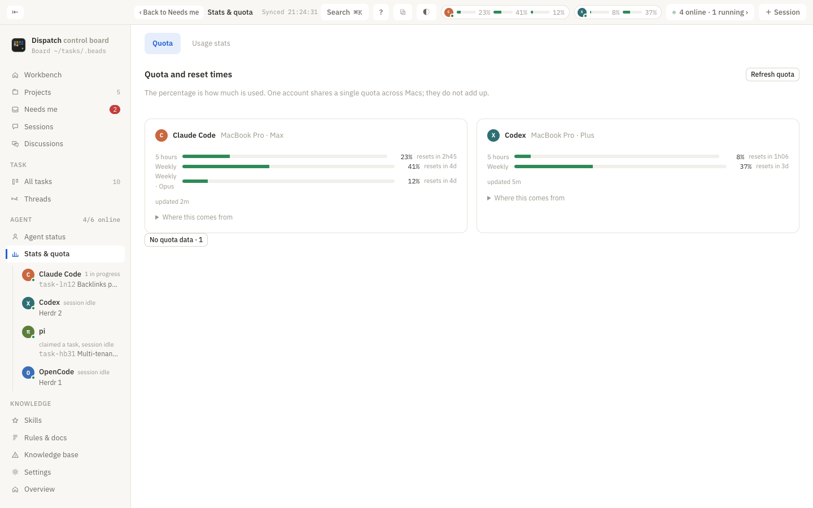
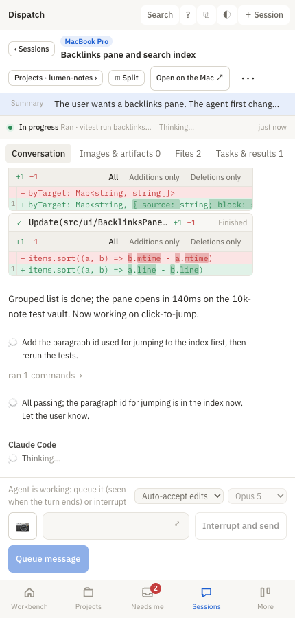

<p align="center">
  
</p>

<p align="center"><a href="README.md">中文</a> · <b>English</b> · <a href="README.de.md">Deutsch</a></p>

<h1 align="center">Dispatch</h1>

<p align="center">
You keep adding AI coding agents. Their sessions, tasks, and progress belong on one desk.<br>
Claude Code · Codex · pi · ZCode · Gemini CLI · OpenCode · Hermes
</p>

<p align="center">
  <a href="https://schaeferanjon.github.io/dispatch/?lang=en"><b>Website and demo video</b></a> ·
  <a href="https://schaeferanjon.github.io/dispatch/manual/#/en/"><b>User manual (searchable, ZH/EN/DE)</b></a> ·
  <a href="https://schaeferanjon.github.io/dispatch/demo/?lang=en#/home"><b>Try it online (sample data)</b></a> ·
  <a href="https://github.com/SchaeferAnjon/dispatch/releases/latest"><b>Download for macOS</b></a>
</p>

<p align="center">
  <a href="https://schaeferanjon.github.io/dispatch/?lang=en"></a>
</p>

Dispatch is a **local** Agent workbench. It reads the records your Agents already keep on this Mac and organizes every session, task, and outcome by **project**: who is waiting on you, who is running, and how far along things are, all at a glance. Reply to the original session from your Mac or your phone, with no extra model process, and by default nothing from your documents or conversations is sent to any model.

Runs on **macOS 14+**, the web interface fits a phone screen, open source (MIT).

## What it looks like

| Workbench: where every project stands right now | Project page: the full record of one project |
|:--|:--|
|  |  |
| Unread replies, sessions waiting for confirmation, running sessions and what they are doing right now, tasks in progress with acceptance progress, and the latest outcomes. | Review (a model-written status plus a 14-day timeline), sessions, tasks, outcomes, documents, and a **knowledge base per project**. |

| Session: follow every step the Agent takes, reply directly | Split view: several sessions side by side |
|:--|:--|
|  |  |
| Thinking, tool calls, changed files, and images on one page; running sessions stream live; queue a message, interrupt and send, withdraw and edit. | 2 or 4 independent panes; ⧉ detaches the current page into its own window; ⌘+click a project, session, or task to open a new window. |

| Needs me: only what needs your attention | Quota, rules, and skills |
|:--|:--|
|  |  |
| Unread replies, confirmation requests, and things only you can do; running sessions do not count as unread. | Usage and reset time for each Agent; one shared rule set synced to every Agent; a skill pool mounted in one place. |

<p align="center">
  <br>
  <sub>Phone: check progress and send a quick reply while you are out; if a session is not running, resume it on the Mac with one tap; if it is stopped at a confirmation prompt, answer with a keypress.</sub>
</p>

## Highlights

- **No change to your habits**: Agents keep running in your terminal or editor. Dispatch only reads the local records they already write (Claude Code and Codex transcripts, including sessions opened from the VS Code extension; the OpenCode, ZCode, and Hermes databases). No API key, and no task board to set up first.
- **Projects are the starting point**: sessions are grouped into projects by folder, and tasks and outcomes hang off sessions; projects can be starred, archived, and renamed, consistently across two Macs.
- **Replies go back to the original session**: open a session from the Workbench, Needs me, or your phone and reply there; the message is delivered to the original session in that terminal. If it is running, the message is queued; if you sent the wrong thing, you can withdraw it.
- **Agents keep their own tasks**: each new session automatically receives its identity, the project's tasks, and relevant knowledge at the start. Agents record tasks with `dispatch begin / log / done` and pitfalls with `dispatch wiki`, so you never have to tick things off in the interface one by one.
- **Two Macs**: one copy of the task board, rules, and skills, kept in sync; move a project to the other Mac with one click, including uncommitted changes, Git history, running sessions, and past records, in the background with a progress bar.
- **Phone**: reach the same interface over Tailscale; notifications via ntfy / Bark / system notifications; view and control the Mac's screen through noVNC when needed.
- **Everything is available from the command line**: whatever the interface shows, `dispatch … --json` can return, and Agents can use it too.

## User manual

Too many features and not sure where to begin? Read the **[user manual](https://schaeferanjon.github.io/dispatch/manual/#/en/)** (full-text search, 中文, English, Deutsch). It is laid out as "Five-minute start → Core concepts → Every page → Phone → Two Macs → Agent conventions → Command-line reference → Troubleshooting", and every page opens by saying what problem it solves.

## Installation

### Install from a Release

1. Go to [Releases](https://github.com/SchaeferAnjon/dispatch/releases) and download the package for your machine:
   - Only an Apple silicon (M series) package is published: `Dispatch-<version>-macos-apple-silicon.zip`. On an Intel Mac, build it yourself as described under "Build from source" below.
2. Double-click to unzip and drag **Dispatch.app** into Applications.
3. The package is not signed with an Apple developer certificate, so Gatekeeper blocks it the first time. Choose either way to allow it:
   - Open Terminal, paste `xattr -dr com.apple.quarantine /Applications/Dispatch.app`, then open the app;
   - Or double-click once, let it be blocked, then go to System Settings → Privacy & Security → scroll to the bottom and click "Open Anyway".
4. Once open, the app goes straight into **first-run setup** (see the next section). If Homebrew is missing, step 1 shows the install command.

Requires [Homebrew](https://brew.sh); first-run setup uses it to install Dolt, Beads, and Herdr.

### Updating

- **In the app**: Settings → Version and updates → "Check for updates" / "Update to vX". It downloads the zip for your architecture from GitHub Releases, replaces `/Applications/Dispatch.app`, and restarts automatically; permissions and login state are preserved.
- **Command line**: `dispatch update check` / `dispatch update apply` (`--no-relaunch` updates without restarting).
- You can also download the Release zip again and overwrite the app yourself.

### Build from source (developers)

Requires Node.js 20.19+ or 22.12+, Rust, Xcode Command Line Tools, and Python 3.11+.

```sh
cd app
npm ci
npm run tauri build
```

The build lands in `app/src-tauri/target/release/bundle/macos/Dispatch.app`. With a working build environment, `app/scripts/install.sh` installs to `/Applications` (build → sync → relaunch). The app bundles the Python CLI and the web assets, so the repository does not need to live in any particular folder.

The task board additionally depends on [Beads](https://github.com/steveyegge/beads) and Dolt; the default task directory is `~/tasks/.beads`, and `BEADS_DIR` overrides it. Sessions, attachments, and instruction checks need neither a model API key nor a task board.

## First-run setup (six steps)

It runs once on first launch. Every step can be rerun, and "Skip, don't ask again" at the top right lets you skip it; you can reopen it later from Settings → First-run setup. In order:

1. **Install dependencies**: detects and installs Dolt, Beads, and Herdr; click whichever is missing.
2. **Terminal command**: links `dispatch` to `~/.local/bin/dispatch` so it is available in the terminal. You can also do it by hand: `ln -sf /Applications/Dispatch.app/Contents/Resources/cli/dispatch.py ~/.local/bin/dispatch`.
3. **Task board**: on the first machine, choose "Only this Mac, or this is the first one" to create a new task board; this Mac becomes the hub. If another Mac already runs Dispatch, choose "Join its task board" and enter that Mac's `user@address` (see the next section).
4. **Agents**: tick the Agents you use on this Mac (Claude Code / Codex / pi / ZCode / Gemini CLI / OpenCode / Hermes) and confirm Herdr is running.
5. **Rules and skills**: prepares the shared rules in `~/.agents/rules/GLOBAL.md`, syncs them to every Agent, and mounts the skill pool under each of them.
6. **Review and optimize** (optional): sends an Agent to review the rules and skills and suggest improvements.

"Finish, go to Workbench" unlocks once the first five steps are ticked.

## Two Macs

After finishing first-run setup, the first Mac is the **hub**: the task board, rules, and skills all live on it.

On the second Mac:

1. On the hub, open System Settings → General → Sharing → **Remote Login** (joining needs SSH).
2. Install Dispatch on the second Mac, choose "Join" in step 3 of first-run setup, and enter the hub's `user@address`. Use the LAN IP on the same Wi‑Fi, or the [Tailscale](https://tailscale.com) address when away; Settings → Machines also has a "Connect another Mac" button.
3. When joining, you can hand the hub's login password to Dispatch and it will place the public key so both Macs reach each other without a password from then on; if you would rather not share the password, let the local Agent do it in the terminal.

Once joined, both sides sync the task board every 2 minutes in both directions (Dolt remote API); tasks, knowledge base, rules, and skills are one shared copy, and the sidebar can filter by machine.

### Move a project or session to the other Mac and continue there

On the project page, "Move to <machine name>" first checks Git and file differences; after you confirm, it moves the folder (including uncommitted changes), the Git history, running sessions, and all past records over, and the other side picks up right where you left off. The move runs in the background with a progress bar on the project. For a single session: right-click the session → "Move to <machine name>", or:

```sh
dispatch project <project name> --move-to <machine id or name>
dispatch move <session id prefix> --to <machine id or name> [--prompt "extra instructions"] [--no-files]
```

Supports Claude Code and Codex; pi keeps its sessions in its own store and cannot be moved yet.

## Phone

Your phone must be able to reach the Mac running Dispatch (Tailscale recommended); do not expose the service to the public internet.

- On the Mac, run `dispatch serve url` to get the address, or `dispatch serve qr` to show a QR code in the terminal.
- Settings → Phone access: shows the same QR code (the link carries a login token, so one scan is remembered), or copy the link and send it to your phone; in the browser you can "Add to Home Screen", and the interface is laid out for phone width.
- **Notifications**: one push when a report is ready, a discussion ends, or a session turns into "waiting for you". Set the channel on the "Environment" page with `NTFY_URL` (an ntfy topic URL) or `BARK_KEY` (a Bark key); with neither set, this Mac sends a system notification. Command line: `dispatch notify "title" "body"`.
- **Screen access**: Settings → Screen access, click "Set up" once (equivalent to `dispatch screen setup`); it installs noVNC with a background service and enables Tailscale HTTPS. All that is left is to turn on "Screen Sharing" in System Settings → General → Sharing. After that, view and control the screen from your phone's browser using this Mac's username and login password (noVNC over Tailscale HTTPS).

The web version and the desktop share the same CLI; updates are done in Dispatch.app on the Mac. How the service runs and its limits are described in [app/README.md](app/README.md).

## Conventions in use

- **Right-click**: tasks, sessions, projects, skills, files, and machines each have their own action menu; right-clicking empty space shows the actions for the current page. When right-clicking is awkward, use `⋯` (tasks, sessions) or the page header menu.
- **Shortcuts**: `⌘K` searches projects / sessions / tasks, `⌘N` starts a new session, `⌘T` creates a task, `⌘R` refreshes.
- **Agents keep the tasks**: every new session starts with the identity, project tasks, and relevant knowledge injected by `dispatch prime`; it records tasks with `dispatch begin / log / done` and pitfalls with `dispatch wiki`. You never need to tick things off in the interface one by one.
- **Session summaries**: "Auto-summarize" is on by default in Settings; every few minutes it summarizes one or two sessions (newest first) and gradually fills in older ones. You can also right-click a session → "Summarize this session with the model" / "Summarize again with the model". The model comes from the `provider:model` set in `SUMMARY_MODEL`; if unset, it uses an API key already in `dispatch env` (Zhipu, DeepSeek, Kimi, MiniMax, OpenAI) or your Claude Code subscription (`SUMMARY_MODEL=claude:haiku`). Command line: `dispatch session-summary run <key>` / `auto` / `providers`.

### Command line

To use the CLI in the terminal, finish step 2 of first-run setup or link `app/cli/dispatch.py` to `~/.local/bin/dispatch` by hand. Everything the interface shows, an Agent can query with `--json`.

```sh
dispatch rules inspect --json
dispatch rules optimize --path ~/.codex/AGENTS.md --model gpt-6-astra --json
dispatch facts show -P harbor-api      # facts: server / domain / database / API names, sectioned by project, injected by prime
dispatch facts sections --json
dispatch task trash TASK_ID --json
dispatch task restore TASK_ID --json
dispatch project ReadOut --star         # star; --archive archives; dispatch projects lists them
dispatch terminal --cwd ~/Projects/x     # open a plain terminal tab in Herdr without an Agent (the "Terminal" button on the project page)
dispatch here                           # this folder/project right now: one-paragraph status, 14-day timeline, unfinished tasks, live sessions here marked "can close / keep open"
dispatch lineage [project]              # threads: project → task → session (started / working / mentioned) → progress and commits; this is what the Threads page draws
dispatch profile show|add|upcoming|done # about me: the user profile Agents maintain (current state / upcoming / happened); inventory --refresh probes each machine
dispatch memories list|show|archive|summary   # each Agent's long-term memories: grouped by project, archive stale ones, have the model write an overview
dispatch summarize providers|set-key|uses    # the summary model, store a key in place (stdin, not echoed), per-use switches and last usage
dispatch prime                          # session-start injection: identity, project tasks, the user's unanswered notes on tasks, knowledge base, facts, quota
```

## Implemented

- **Workbench**: laid out by project; each card is where that project stands right now: sessions waiting for your reply (unread replies, waiting for confirmation), running sessions and their current action, tasks in progress with acceptance progress, and the latest outcomes. Projects with no activity for three days collapse to a single line. The top shows the count of things that need you and each Agent's quota.
- **Starring and archiving**: a project can be starred (pinned to the top) or archived (hidden from the Workbench and the project list, recoverable at any time). The state lives in one memory on the shared task board, so both machines agree; the CLI is `dispatch project <name> --star|--archive`.
- **Project page**: the full record of one project, with sessions, tasks, outcomes, unassigned tasks, and folders on their own pages. Sessions show explicitly linked tasks; a task can name its originating and participating sessions; an outcome can roll up several tasks and sessions; the folder page can open Finder or start a new session in that folder.
- **Project review**: the "Review" page of a project, or `dispatch here` in any folder, shows a one-paragraph status (written by the summary model chosen in Settings), a 14-day timeline (task progress and completion, git commits, and session summaries grouped by day), unfinished tasks with acceptance progress, and what every live session in this folder is doing plus "can close / keep open". Tasks appear by title in prime, the session list, and Herdr tabs, with the task-id only as a suffix.
- **One project rule**: session ownership follows one rule: manual link > home directory (no project) > `~/Projects/<name>/…` > a project name known to the task board appearing in the path > folder name. Sidebar counts, the Workbench, the project page, and search all use the same list.
- **Explicit ownership**: the relation between a task and a session is only the `session:` / `session-origin:` label. Mentioning a task ID in a conversation, the same Agent, or the same folder does not count as ownership; those are reference information shown folded.
- **OpenCode and ZCode sessions**: both keep their conversations in their own SQLite databases (`~/.local/share/opencode/opencode.db`, `~/.zcode/cli/db/db.sqlite`), and Dispatch reads them directly: they show up in the session list, Workbench, Needs me, and Agent status; a session counts as live when the process is running and has written recently; the session page shows the full conversation; an OpenCode session can be resumed with `opencode --session <id>`.
- **Hermes sessions**: Hermes Agent (the assistant behind Telegram / WeChat / scheduled jobs) stores each session in `~/.hermes/state.db`, and Dispatch reads it directly: the session list, Workbench, Needs me, Stats, and the Agents page treat it as the independent Agent `hermes`; the source (terminal / chat / scheduled) shows on the Agents page, and sessions started by cron automatically count as scheduled; resume with `hermes chat --resume <id>`.
- **Threads page**: a node-and-edge graph: task → the session that started it (thick main line; other tasks a session handled on the side are thin dashed lines) → progress / completion / commits ordered left to right by time. Node names are the task title, session title, or the first sentence of the progress note, never abbreviated; hover or select a node to highlight its whole line and see details in the right pane. The "List" tab is the same data as a tree.
- **Outcome traceability**: an outcome has its own content and entry point and can link several tasks and sessions; past completion notes are kept separately, and you are not asked to review them one by one. Outcomes and trashed tasks do not enter the Threads graph.
- **Needs me**: the badge and system notifications count only unread replies and confirmation requests; blocked tasks, Agent-to-Agent reviews, and scheduled sessions are excluded. Running sessions do not count as unread.
- **Global search**: ⌘K searches projects, sessions, and tasks; ⌘N starts a new session.
- **Sessions and attachments**: continuously reads local records; images are shown inline, with a central preview for images, PDF, HTML, audio, video, and text. Multiple record files of a resumed session are merged per session.
- **Reply to the original session**: open a session from the Workbench or "Needs me" and reply directly; desktop and phone web share the entry point. Supports sessions open in the Codex desktop app and idle Claude Code / pi / Codex terminal sessions in Herdr whose identity can be confirmed exactly; no extra model process is started. Drafts are kept per session, duplicate requests are sent only once, and a timeout shows an unconfirmed state.
- **Task actions**: the board and the table support right-click or the `⋯` menu. A task can be moved to the trash and restored to its previous state, keeping description, comments, and dependencies.
- **Stats and quota**: one entry point switches between the quota overview and usage stats, showing the share used, reset time, data source, and last update. Missing or stale data is marked as such, never guessed as zero.
- **Global instructions**: detects the customary document locations and Markdown references for Codex, Claude Code, pi, ZCode, Gemini, and OpenCode, recognizing Codex override precedence and symlinks.
- **Optimization and consistency**: picks Codex, Claude, or generic check rules based on the detected or manually set model. Checks duplicates, candidate conflicts, circular or dead references, document length, personal paths, and managed copy versions. Auto-optimize only merges clearly adjacent duplicate entries; semantic changes go through suggestions, editing, and a diff preview.
- **Recoverable edits**: rechecks every document version before saving; existing managed copies of the shared source file are previewed and saved together; a recovery version is kept. If another program modified the file, the overwrite is refused.

"Rules & docs" has two areas:

- **Agent rules**: pick global or a detected project to check, edit, preview, and restore the project's AGENTS.md / CLAUDE.md together with the inherited global rules. Shared rule sync lives here too.
- **Reference**: keys and APIs, servers and databases, Obsidian vaults. Server facts are still edited in `~/.agents/rules/FACTS.md`: `## 通用` is injected into every session, `## <project name>` only into that project; secret values go only into `dispatch env`. For Obsidian, only vault metadata is detected and an open entry for the current device is provided; notes are never moved or uploaded.

`optimize` only returns suggestions and diffs; it never modifies a document immediately. The interface provides edit, check, apply, and restore steps. The model name only affects the local check configuration and **never calls that model**; "Copy the deep-review prompt" hands the selected context to your own Agent.

## Data and boundaries

Dispatch reads the local Agent records you already have and by default sends no documents or chat content to any model. It currently does not connect to ChatGPT web sessions and cannot obtain "read" receipts from the original Agent app; only a later user message clears the unread state of earlier replies. The workspace Git diff may include changes from other sessions.

When you click send, the reply is delivered only to the original session on the selected Mac. Codex desktop replies depend on the client's current versioned local IPC interface; if it is incompatible or the session is not open, you are asked to reconnect. A Herdr terminal must match both the session ID and the foreground process; no input is written while it is executing or waiting for a permission confirmation. Send receipts are stored locally in `~/tasks/.dispatch/reply-receipts.sqlite` and are not copied across machines.

Attachments are read only from files the current session explicitly attached or linked, with a 20 MB limit per file. HTML is previewed in an isolated iframe with external network access disabled; images in the same folder can be embedded. Complex artifacts that depend on external libraries need to run in their original project. If a file has been cleaned up, the reason is shown.

"Possible conflict" is the result of a static check, not a full semantic proof. Changing rules does not reload running Agent sessions; start a new session according to that Agent's loading mechanism.

## Verification and contributing

```sh
cd app
npm test
npm run test:py
npm run build
```

Business logic lives in `app/cli/`; Tauri and HTTP share the CLI, and React only renders. New transport capabilities must be verified on both desktop and web. Use a temporary directory to test document writes; do not add real sessions, configuration, keys, or screenshots to the repository.

The project code is under the [MIT License](LICENSE). Third-party libraries keep their own licenses; Python, Beads, Dolt, the Agent clients, and the optional remote desktop tools are used as independent dependencies.

## Project relations and Agent deliverables

Relations are stored on the shared task board and both machines use the same data after syncing:

- `project:<name>`: the owning project.
- `session-origin:<id>`: the originating session; `dispatch begin` records it automatically when the session identity is available.
- `session:<id>`: an explicitly linked originating or participating session; there can be several.
- `dispatch:outcome`: an independent outcome record that does not count as an ordinary task.
- `outcome-task:<task-id>`: the task an outcome came from; there can be several; the `session:` labels on an outcome record its source sessions.
- `dispatch-projects` (bd memory): starred and archived state of projects. Memories starting with `dispatch-` are Dispatch's own records and do not appear in the knowledge base, `dispatch wiki`, or `dispatch prime`.

An Agent can use the existing `bd create` to create a record with `dispatch:outcome`, project, and source labels, put the delivery notes and file links in the description, then `bd close` to complete the registration. Users can also register or edit outcomes on the project's "Outcomes" page. Do not bulk-write ownership based on mention counts, and do not automatically copy every completed task into an outcome.

The Workbench merges live activity with the historical session index. The index still follows the existing read limits (500 for the local list and 200 for the remote list); historical entries show no unread or inferred running state.
