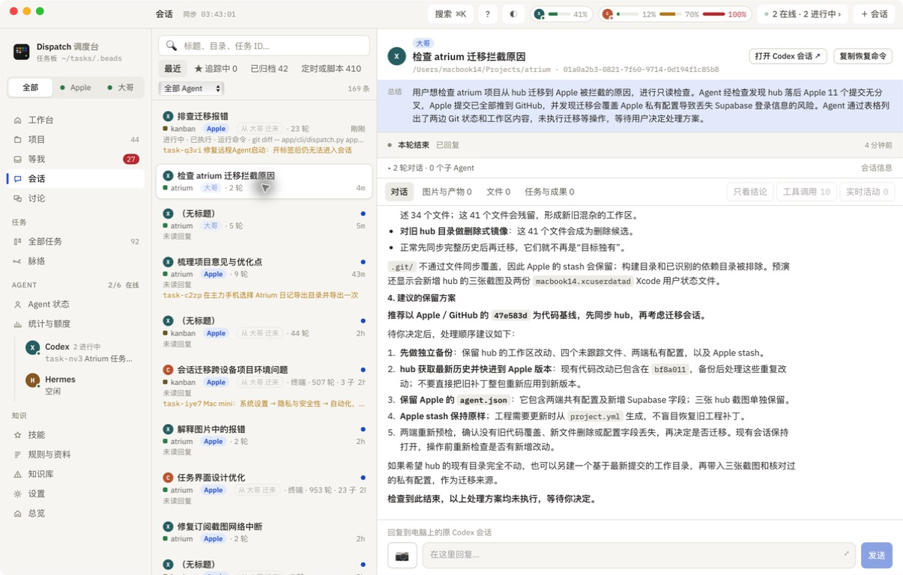

# 派发会话的启动反馈与实际回复

任务：`task-q3vi`。验证日期：2026-09-15。

## 结论

用户从 Apple 发起的「检查 atrium 迁移拦截原因」已在大哥启动，收到第一句话并完成只读检查。问题出在派发窗口的返回时机：桌面与网页入口使用 CLI 默认等待模式，等待 Agent 做完才返回，最长十分钟；界面持续显示「起中，等它回话…」，让已启动的会话看起来没有成功。

此前的 Herdr 会话选择修复仍然保留：配置的 `main` 未运行时，会选择实际运行的唯一会话，不会反复创建标签。

## 本次调整

- 桌面和网页派发使用 `--no-wait`：等 Agent 就绪、发送第一句话后即返回，后台继续工作。
- 成功后显示「会话已启动，第一句话已发送」，并提供「查看会话」入口，打开目标电脑的会话列表。
- 消息发送失败时保留错误说明，不宣称已发送。命令行默认等待完整回复的行为保留。

## 验证

- 24 项 Python 测试通过，覆盖非等待派发、消息发送失败、网页参数传递、远程 Herdr 选择与会话控制。
- TypeScript、Vite、Tauri 构建通过；Mini 与 MacBook 已安装并重启相同构建，主程序及 CLI 的 SHA-256 均一致。
- 实际读取大哥的 `w9:p3`，确认用户提示词和 Agent 回复；在 Mini 的 Dispatch 打开同一会话，看到检查结论。
- 新派发的返回时机由回归测试验证；未重复创建检查 Agent，也未执行项目迁移。

## 01 · Mini 上已打开实际检查会话

右侧可见「检查 atrium 迁移拦截原因」、所属电脑「大哥」及完整回复。截图中的迁移方案是该检查 Agent 的建议，尚未执行。

