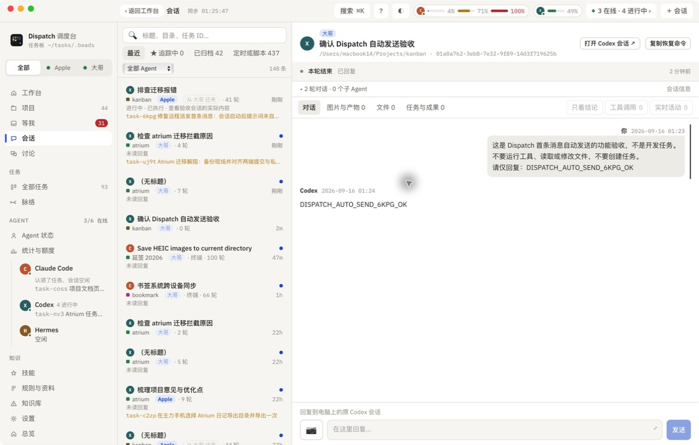

# 首条消息自动发送修复与实测

2026-09-16 · `task-6kpg`

## 原因与修复

Codex 0.154 的输入区持续显示粒子动画。旧启动检测要求连续几次读取到完全相同的终端文本，虽然 Herdr 已报告 `idle` 和 `interactive_ready=true`，仍然等不到画面静止，最长拖延 90 秒才尝试发送。此前修复了等待整轮回复的问题，未覆盖这个发送前的环节。

现在依据连续两次输入就绪状态发送，不再等待画面静止；只检查当前可见的启动提示。发送后通过 Herdr 的状态变化确认消息被接收，`--no-wait` 在 Agent 开始处理时返回，CLI 默认模式仍等待回复完成。

若尚未就绪，明确报告未发送；若检测到用户已手动开始对话，跳过自动发送。发送结果不确定时不重发正文，避免重复。

## 实际验证

1. 同一个远端空闲 Codex 会话：旧检测设置 8 秒上限后，实际 10.5 秒返回失败；新检测约 3 秒返回就绪。连续读取确认只有动画在变，输入状态一直为就绪。
2. 从 Mini 通过完整的 `dispatch agent start codex --host hub --no-wait` 流程新建测试会话，自动发送三行提示词；接口返回 `working`、`prompt_sent=true`。
3. 大哥的测试会话 `w9:p8` 自动回复 `DISPATCH_AUTO_SEND_6KPG_OK`；全程未手动输入。Mini 的 Dispatch 已打开并核对相同的消息及回复。
4. 31 项 Python 回归测试通过，覆盖动画输入区、就绪标志、用户手动输入、发送未确认不重复、CLI 等待语义及远端会话控制；Tauri 构建通过。

两台机器已安装相同构建并重启。源码与两台安装包的 CLI SHA-256 均为 `0f4d0c058b5f4a9b0bfd36ff4e77ac24ee89a540c75f0f717bb23fcca5b74666`。验收后只关闭本次新建的两个测试标签，保留用户的 Atrium 会话。

## 02 · 自动发送的测试消息与回复

截图右侧包含自动发送的三行消息和 Codex 回复，消息未要求任何项目操作。

