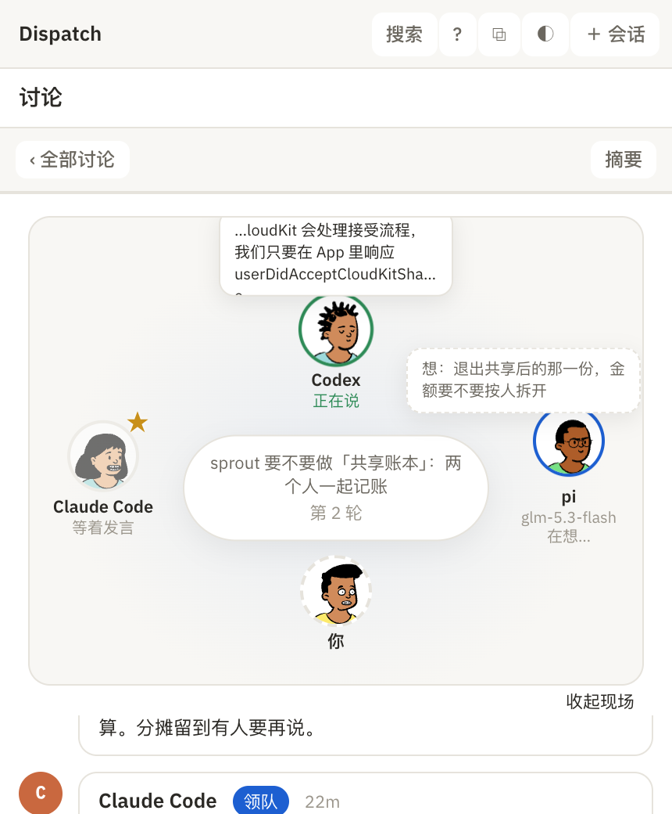

# 讨论现场（小人围坐）

讨论页顶部新增的「现场」视图：每个成员一个小人（DiceBear Open Peeps，库 MIT、画作 CC0，按成员名字本地生成，同一个成员永远是同一张脸），你坐在下方。

1. 桌面：Codex 正在说（绿圈、气泡里是实时文字），pi 在想（虚线气泡显示它在想什么），Claude Code 是领队（★），排在最后发言。

   

2. 手机宽度：同一套布局，气泡靠边的向内展开，不会被裁掉。

   

状态：等着发言（变淡）、在想（上下浮动 + 虚线气泡）、正在说（轻微跳动 + 实时文字）、说完了、这轮没话说、没说上话（红色，气泡里是原因）。点小人能看 ta 最近说的完整一段。右下角「收起现场」可以关掉，只看文字记录；选择会记住。
