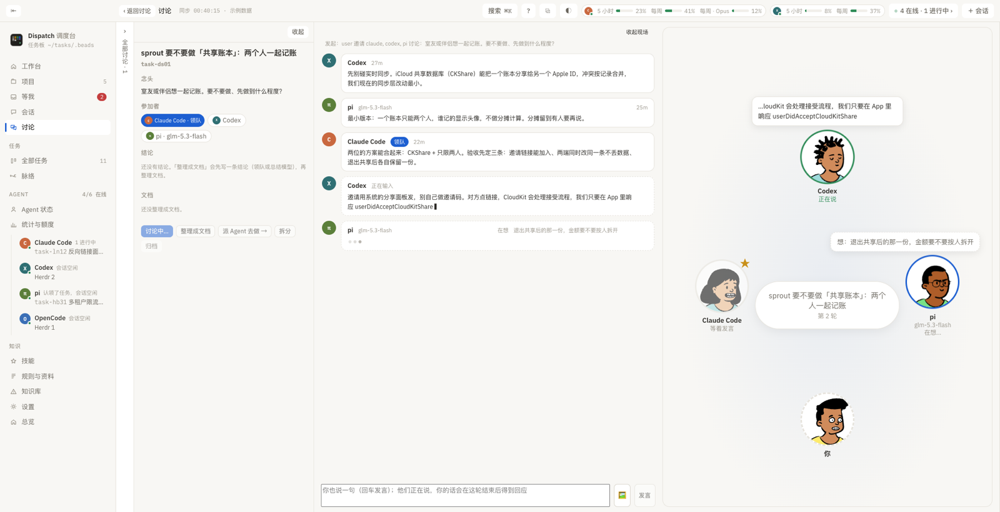
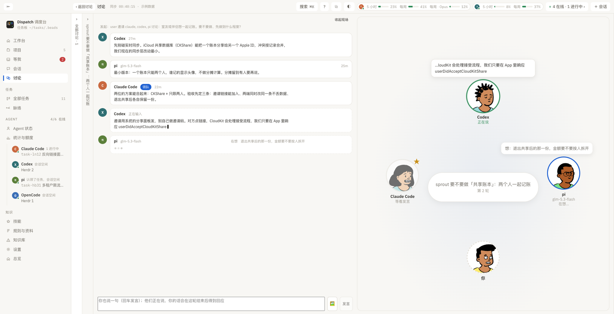
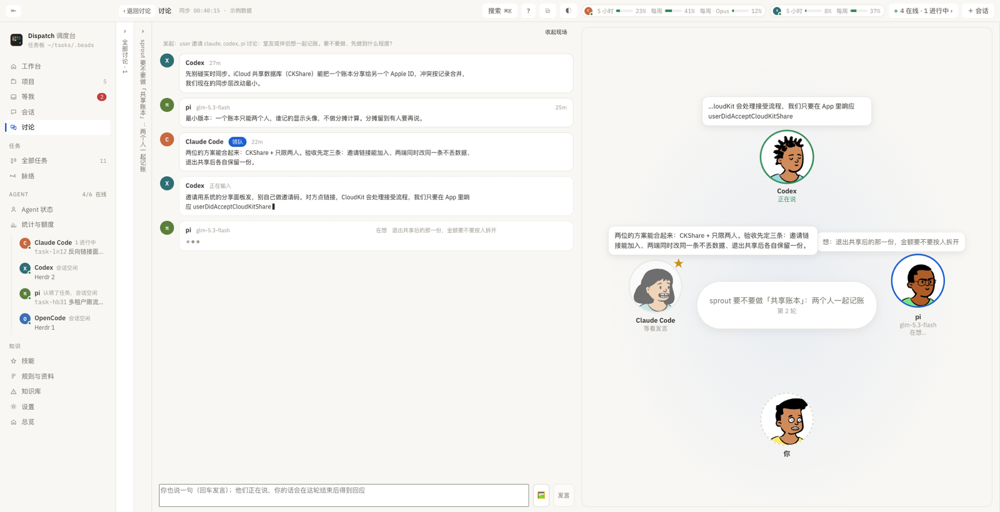
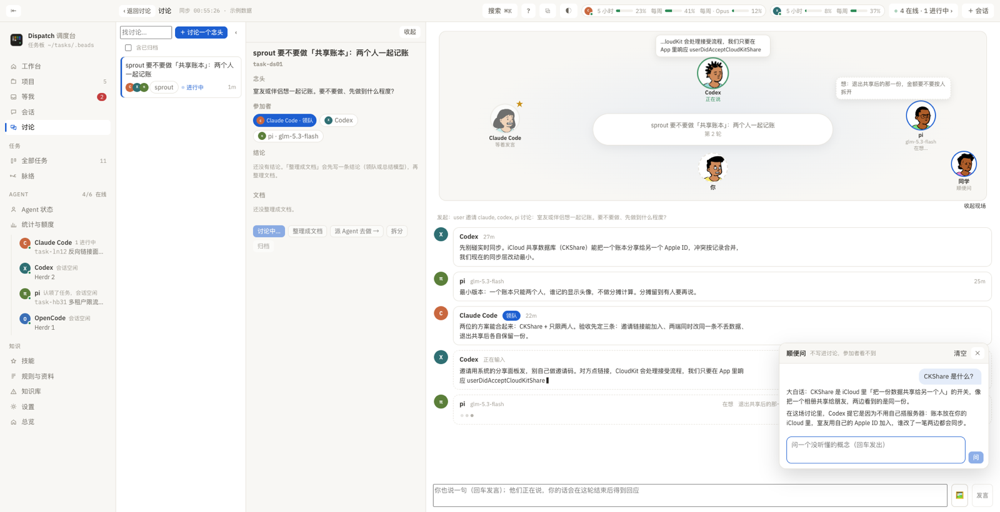
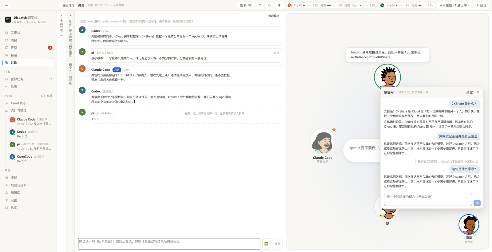
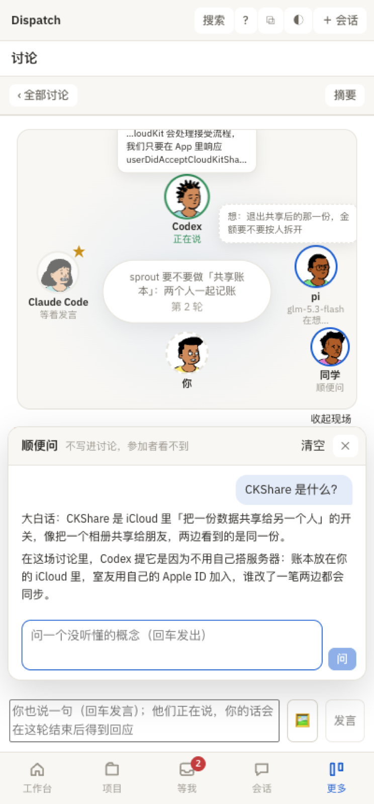

# 讨论现场（小人围坐）

讨论页顶部新增的「现场」视图：每个成员一个小人（DiceBear Open Peeps，库 MIT、画作 CC0，按成员名字本地生成，同一个成员永远是同一张脸），你坐在下方。

1. 桌面：Codex 正在说（绿圈、气泡里是实时文字），pi 在想（虚线气泡显示它在想什么），Claude Code 是领队（★），排在最后发言。

   

2. 手机宽度：同一套布局，气泡靠边的向内展开，不会被裁掉。

   

状态：等着发言（变淡）、在想（上下浮动 + 虚线气泡）、正在说（轻微跳动 + 实时文字）、说完了、这轮没话说、没说上话（红色，气泡里是原因）。点小人能看 ta 最近说的完整一段。右下角「收起现场」可以关掉，只看文字记录；选择会记住。

## 两栏收起与并排布局（2026-09-18）

示例数据下的截图，窗口 2000×1025。

3. 只收起讨论列表：列表变成一条窄栏，点一下展开。聊天栏够宽，聊天在左、现场在右。

   

4. 列表和摘要都收起：聊天在左，讨论现场占右半边，小人和气泡放大。

   

5. 点一个小人看他最近说的话：长气泡不出框，盖在旁边的气泡上面。

   

## 顺便问：旁边的同学（2026-09-18）

看讨论时有没听懂的，问坐在现场角落的「同学」。问答存在讨论旁边，不写进任务，参加者看不到。示例数据下的截图。

6. 普通布局：同学坐在现场右下角，面板开在右下，不挡发言流的主体。

   

7. 并排布局：在讨论里划一句话点「问同学」，那句话会作为引用带上，直接回车就是问「这句是什么意思」。

   

8. 手机：面板从底部展开。

   
