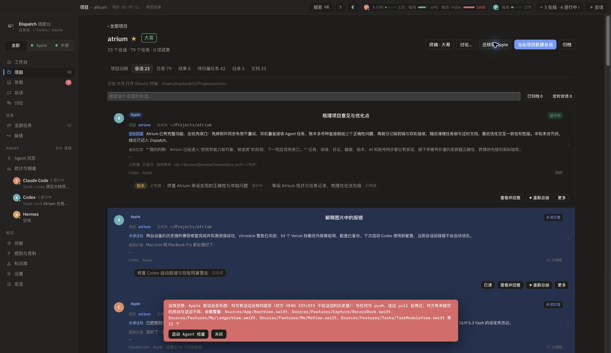
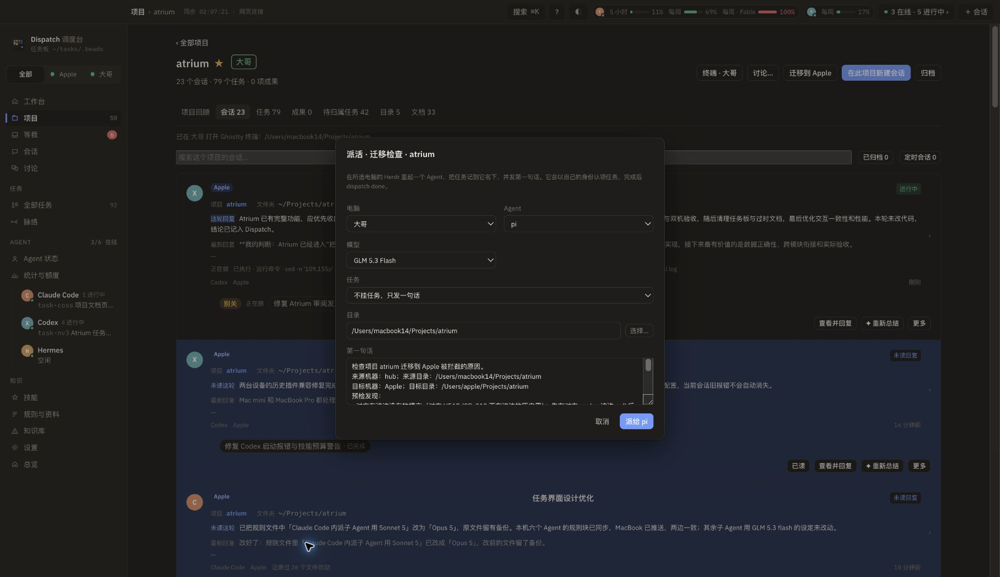
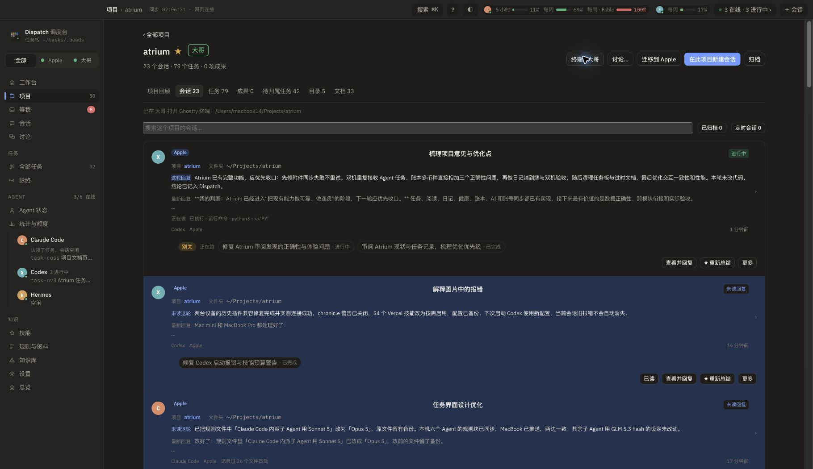

# 迁移检查与终端入口修复

## 改动

- 迁移预检被拦截时，红色提示保留显示，新增「启动 Agent 检查」。点击进入已填好机器、目录、完整冲突的派活界面，默认 pi / GLM 5.3 Flash；任务只读检查并提出保留两边工作的方案。
- 项目终端遵循交接后的项目归属，按钮显示目标机器。成功或失败都在项目页显示结果，不再仅把错误放进「项目回顾」。无目录时禁用按钮。

## 实际发现

- Atrium 迁往 Apple 的预检发现：Mini 的 HEAD `f37c013` 不在 MacBook 当前历史中。直接覆盖会丢掉 Mini 上的新提交，因此保留迁移拦截。
- 排查开始时，两台安装包的主程序及 CLI 校验值一致。Mini 自身的 `dispatch terminal` 成功创建 Herdr 标签，并返回 Ghostty。
- 项目终端原来按历史会话最多的目录选机器：在 Mini 界面点按钮也可能在「大哥」开窗，界面却没有告知。
- 两台的定时服务同步任务板与资料，没有配置「Git 提交后自动构建并更新另一台 Dispatch」。应用内更新读取 GitHub Releases；源码提交与桌面安装包更新是两个步骤。

## 验证

- 7 项定向测试通过；TypeScript、Vite、Tauri 构建通过。
- 本机安装版实际操作：Atrium → 迁移到 Apple → 冲突红框 → 启动 Agent 检查；两台目录、冲突、模型均正确预填。
- 未实际派发检查 Agent，也未执行项目迁移。

## 截图

### 1. 迁移拦截与检查入口

### 2. 已预填的检查任务

### 3. Mini 网页终端反馈

在 Mini 提供的网页切到 Atrium「会话」，点击「终端 · 大哥」，显示「已在 大哥 打开 Ghostty 终端：/Users/macbook14/Projects/atrium」。因此无需切回「项目回顾」就能知道窗口开在哪里。

## 最终安装核对

两台主程序 SHA-256 均为 `19b12040b4ecad1b91423797146e4b41eb9b346127b15fff660ece8221ed1797`；网页入口 SHA-256 均为 `dd07234a0a08069d81cbaa3717b475fe9f96bc80d460f03c985c0dedfb97cb0f`。网页加载新资源 `index-_keP7XSD.js`。

桌面版及 Mini 网页已实际操作。浏览器错误记录仅包含扩展脚本错误及重启服务时旧页面的一次轮询失败；新页面操作成功。未测试手机尺寸和检查 Agent 的实际执行。
