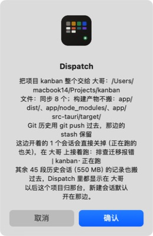
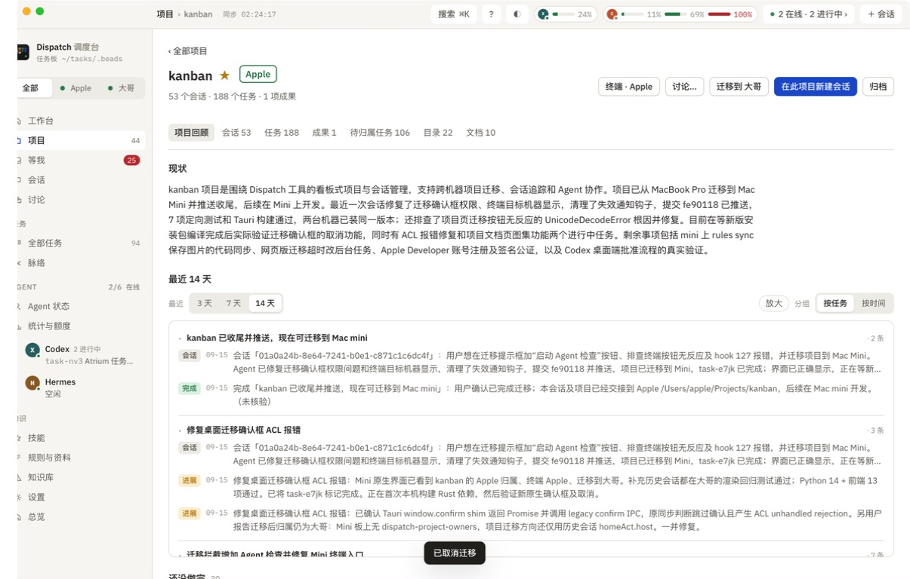

# Mini 迁移确认框与项目归属验证

2026-09-15 · task-j64g · Apple Mac mini 原生 Dispatch（tauri://localhost）

## 结果

- kanban 标题旁显示 Apple，终端显示「终端 · Apple」，迁移按钮显示「迁移到 大哥」。
- 点击迁移只做预检，原生确认框正常显示；点击取消后显示「已取消迁移」，按钮恢复，项目留在 Apple。
- 原生界面没有再次出现 `plugin:dialog|confirm not allowed by ACL` 红条。
- 用户已完成 kanban 迁移，任务 task-e7jk 已关闭。

## 根因与修复

Tauri dialog 2.7.3 的 `window.confirm` shim 返回 Promise，并调用旧的 `plugin:dialog|confirm`。原同步布尔判断既没有等待确认，又产生 ACL 拒绝的未处理错误。改为 await 插件正式 confirm API，它调用已获授权的 message IPC；浏览器保留原生 confirm。三个调用点（项目迁移、会话迁移、记忆归档）统一处理。

参考：[Tauri 官方确认框接口](https://v2.tauri.app/plugin/dialog/#create-okcancel-dialog)。

实查大哥已有 kanban → Apple 归属记录，Mini 缺失。已补齐；后续迁移在两台直接写归属并报告写入失败。迁移按钮改用项目归属及对应机器的目录，不再只按历史会话分布决定来源。

## 验证范围

| 检查 | 结果 |
| --- | --- |
| 前端 13 项定向测试 | 通过：原生 IPC、等待/取消/确认/错误、浏览器分支、历史会话与项目归属冲突 |
| Python 14 项迁移测试 | 通过：Git 冲突保护、路径/同步、两边归属写入及失败报告 |
| TypeScript / Vite / Tauri release | 通过 |
| 原生实际操作 | kanban → 迁移到大哥 → 确认框 → 取消；项目仍为 Apple |
| 安装 | 两台使用同一构建，主程序 SHA-256：`8f9df88d28d6566da2ba1a77581d3b5e3d3cac30042e8bacd841306fec0e0e2d` |

Browser plugin 未提供；本次问题位于原生 Tauri 权限层，使用 CUA 操作安装版验证。没有浏览器 console 采集；通过原生错误条及实际操作结果检查。未执行真实迁移、未关闭任何项目会话，也未对真实记忆执行归档。移动视口不涉及此次原生确认框验证。

## 1. 原生确认框

## 2. 取消后的项目页

