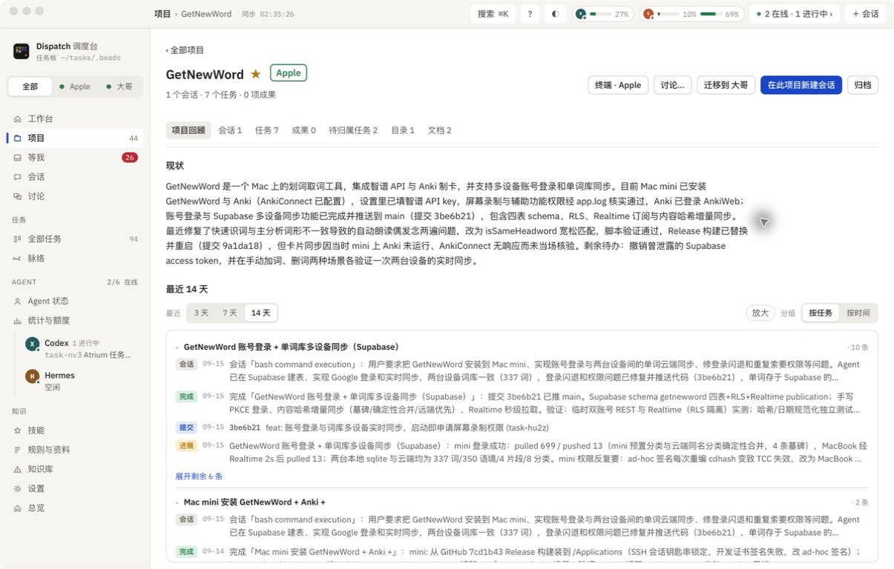
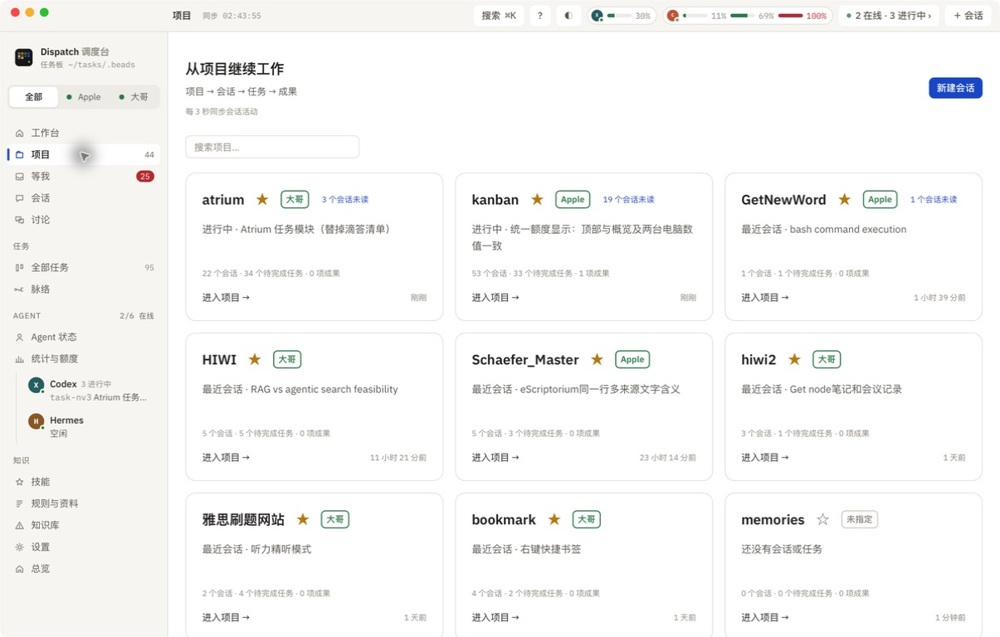
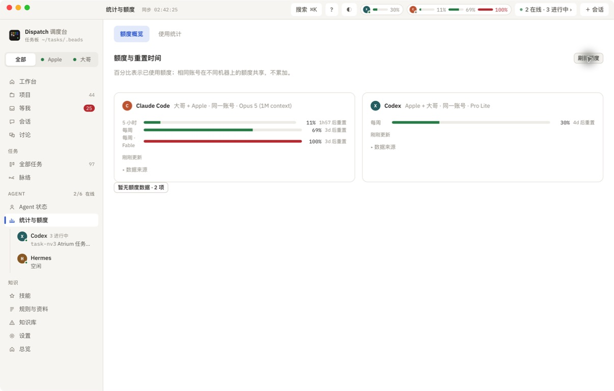
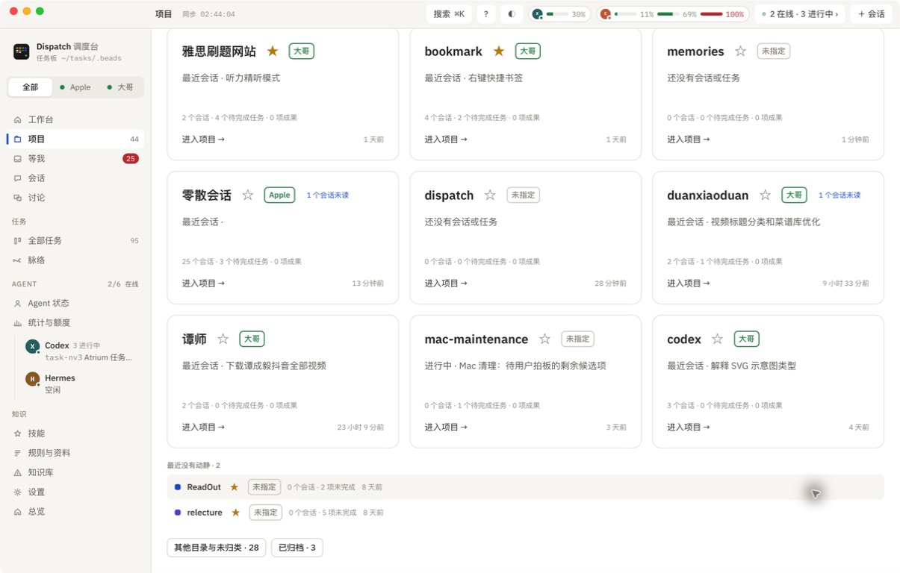

# 迁移归属、项目机器标签与额度一致性

2026-09-15 · 实机：Apple Mac mini；同一安装包已同步到大哥 MacBook Pro。

## 结果

- GetNewWord 两台归属记录均为 Apple；Mini 详情显示「Apple」「终端 · Apple」「迁移到 大哥」。新会话默认 Apple，目录 `/Users/apple/Projects/GetNewWord`。
- 项目卡片、最近没有动静的项目行与详情共用归属标签。先用交接记录，再用现有会话目录所在机器；无记录显示「未指定」。
- 顶部、额度概览和菜单栏使用同一份额度快照，刷新概览也更新顶部。同 Agent 的重置窗口吻合时选择最新读数，不累加；缺少重置时间或窗口不一致时保留分开的来源。
- 实测顶部和概览 Codex 均为 30%，Claude Code 均为 11% / 69% / 100%。切到「大哥」过滤后，共享订阅仍取 Apple 的最新 Codex 记录。

## 原因与修复

### 迁移已完成但 Mini 仍显示大哥

大哥的 `~/.local/bin/dispatch` 仍指向旧项目源码。应用安装包更新了，远程命令却继续执行旧代码，因此交接记录只写在源机器。远程 SSH 还有统一 60 秒截止，网页版还有 300 秒截止，外层连接中断可能掩盖仍在运行的迁移结果。

默认远程入口现优先用已安装 Dispatch 内的 CLI；显式自定义路径保留，未安装应用时回退原 CLI。迁移保留各步骤超时和 SSH 心跳，移除固定外层截止。连接中断明确提示结果尚未确认；预检保留 180 秒上限。

本次核对 GetNewWord 两台 HEAD 同为 `3be6b21c14e774263e55ecf6c4c624ef1f0bb388`，Git 工作区均干净。修复 Mini 缺失的归属后，又从大哥通过真实 SSH 执行 `set_owner`，观察 Mini 记录时间戳变化，验证目标端写入确实执行。没有再次迁移项目或关闭 Agent 会话。

### 顶部额度、概览和两台电脑显示不同

顶部原来默认只看本机，概览会合并远程较新读数；两处还各自定时请求，存在不同快照。现场 Apple Codex 为 29%，大哥旧记录为 19%；Apple Claude 状态栏旧记录为 10% / 69%，大哥 OAuth 较新记录为 11% / 69% / 100%。

现在 App 统一获取和刷新，再交给共享选择函数；同一窗口按时间选择最新整份读数，不因本机/远程顺序改变结果。Codex 时间戳原来错误经过本地夏令时换算，导致时间少一小时；现用现有 ISO UTC 解析器，保留毫秒。

## 验证与边界

- 33 项远程入口、迁移、远程缓存及网页版测试通过。
- 新增 1 项 Berlin 夏令时下 Codex UTC 时间回归通过。
- 8 项前端测试通过，包括来源顺序、选定机器共享额度、未知重置时间不合并、整份窗口及渲染一致性。
- TypeScript、Vite、Tauri release 构建通过；已安装 Mini 并同步/重启大哥应用及网页版。
- 两台安装主程序 SHA-256 相同：`1f4f55001504149b29f234d234796e9c2956b0ce98a9428abb14b041e8ea5463`。
- 两台 CLI SHA-256 相同：`02006367cb0e39c5d44a0863691bad470c984ef340b2d91f73c38a567df843f7`。
- 两台 CLI 实测均拿到 Apple 最新 Codex 30% 和大哥 Claude 11% / 69% / 100% 的相同来源。
- Mini 原生界面验证了项目标签、安静项目行、顶部/概览、手动刷新及机器过滤。大哥验证安装文件与实时 CLI 数据，未远程截图它的原生窗口。
- 未执行一次超过 60 秒的真实项目迁移；此路径通过模拟超时参数测试和真实 SSH 归属写入验证。未做手机端验证。
- 额度仍依赖 Agent 写入和远程缓存，应用每分钟刷新；两台不会在同一毫秒更新。窗口吻合是共享账号的推断依据，当前数据不含稳定账号 ID。

## 实机截图

### 1. GetNewWord 已属于 Apple

### 2. 项目卡片显示电脑

### 3. 顶部与概览额度一致

### 4. 安静项目也显示归属

