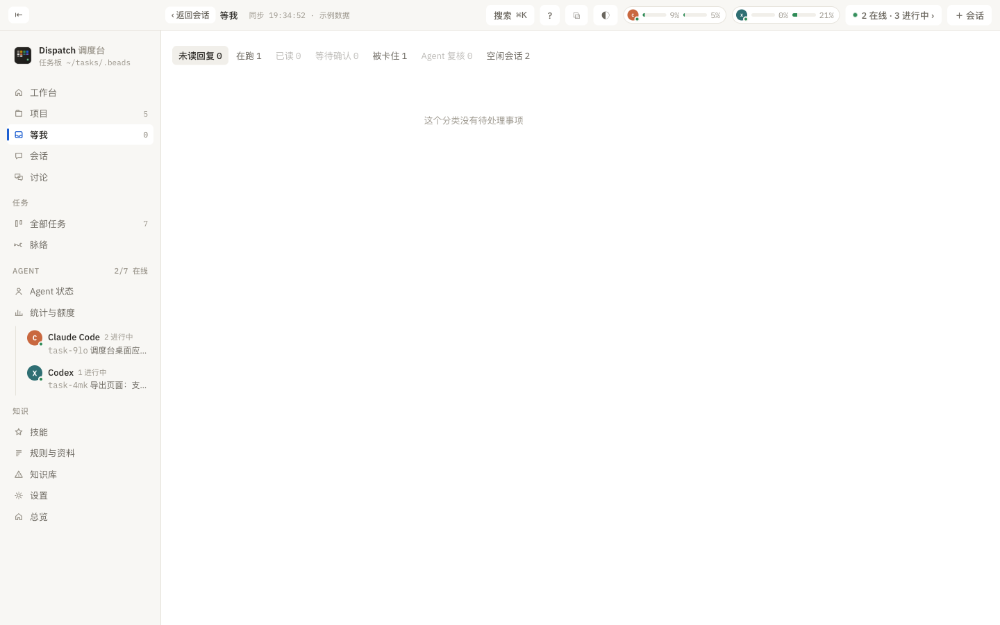

# 等我

> 这一页解决什么：「等我」只放需要你处理的事。这里讲七个分类各是什么、哪些计入红点和通知、以及怎样快速清掉。

## 分类

顶部一排标签，每个带数量：

| 标签 | 放什么 | 计入红点 |
|:--|:--|:--|
| 未读回复 | Agent 答完了、你还没读到最新一轮的会话，按项目分组；每条只留一行「未读这轮」摘要（由总结模型写；关了总结就显示回复的前 300 字） | 是 |
| 在跑 | 现在正在工作的会话 | 否 |
| 已读 | 最近七天读过的回复，最新在前，再看一眼或接着回复 | 否 |
| 等待确认 | Agent 停在权限、信任目录等确认框上。只有接入事件上报的会话（Herdr 里跑的）会出现；Codex 桌面端等没有上报的会话请到会话页看 | 是 |
| 被卡住 | 有未完成依赖的任务，等依赖完成会自动解开 | 否 |
| Agent 复核 | 明确发起过复核请求（`dispatch done --review-by`）的已完成任务，显示未勾选的验收项数和是否缺完成说明；「查看验收」打开任务 | 否 |
| 空闲会话 | 开着但没在跑、也不等你的会话 | 否 |

「只能你做」的事不在这一页，而在项目页「任务」标签的第一列，见 [项目页](04-project.md#任务)。

侧栏「等我」的角标 = 未读回复 + 等待确认 + 只能你做。系统通知只在会话变成「等你」时发一次。

## 怎么清

- 打开一段会话读到最新一轮，停留一下，未读自动移出。在原终端里继续回复也会被识别。
- 「已读」按钮或右键「标记已读」直接清掉一条；「全部标记已读」清掉全部（顶部或空白处右键都有）。
- 右键「标为未读」可以把一条放回来稍后再看。
- 「查看并回复」进入会话页。等待确认的会话可以在会话页直接按键，见 [会话页](05-session.md#回复框)。
- 「✦ 总结」让模型写一段总结（会调用 API）。

全部清完显示「✓ 暂时没有等我的事项。新回复会出现在这里；读到最新后自动移出」。
