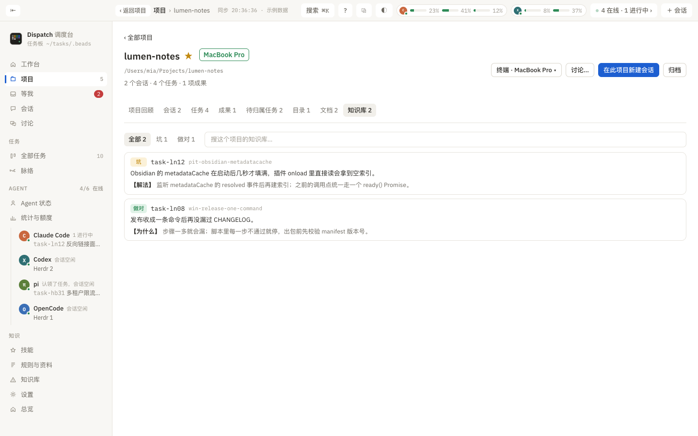

# 知识库

> 这一页解决什么：所有 Agent 共用的经验库长什么样、四种条目怎么记、怎么被 Agent 用到。



## 它是什么

知识库存在任务板的 memory 里（Beads memory），所有 Agent 共用，两台电脑同步。会话启动时 `dispatch prime` 只注入当前项目和通用条目；其余 Agent 用 `dispatch wiki search <关键词>` 按需查，也可以 `--semantic` 按意思找。任务收尾 `dispatch done --retro` 会自动生成一条复盘。

## 四种条目

| 类型 | 正文 | 附加字段 | 怎么来 |
|:--|:--|:--|:--|
| 坑（pit） | 现象 + 原因 | 解法 | Agent `dispatch wiki add --kind pit "现象" --fix "解法" -P 项目`，或界面「＋ 记一个坑」 |
| 做对（win） | 什么做法被证明是对的 | 为什么对 | `--kind win --why` |
| 复盘（retro） | 这个任务做了什么 | 技术、做对、做错 | `dispatch done --retro "【技术】…【做对】…【做错】…"` 自动生成 |
| 做法（howto） | 一套可复用的步骤 / 命令 | | `--kind howto` 或「＋ 方法」 |

每条可带项目和关联任务；key 自动从正文生成，也可以自己填。

## 页面

- 搜索框：关键词、项目、任务 ID。
- 筛选：**常用**（坑、做对、方法，不含自动复盘，默认）、全部、坑、做对、复盘、做法、其他记忆（没有类型的普通 memory）。
- 每条：类型标签、key、项目、任务、正文和字段；「编辑」「删除」（点两次确认）。右键：编辑、复制内容、复制 key、打开任务、只看这个项目的条目、删除。
- 空白处右键：记一个坑、记一件做对的事、记一个方法、重新读取知识库。
- 记完提示「已记录。同项目的 Agent 下次会话启动会看到」。

以 `dispatch-` 开头的记忆是 Dispatch 自己的记录（项目收藏与归档状态等），不出现在这里，也不注入给 Agent。

## 在别处出现

- 项目页「知识库」标签：只看本项目的条目。
- 任务详情右栏「相关的坑」：按任务意思找到的坑。
- 任务完成时的复盘会进这里。

## 命令行

```sh
dispatch wiki search "关键词" [--semantic] [--limit 5]
dispatch wiki list [-k pit|win|retro|howto|all] [-P 项目]
dispatch wiki show <key>
dispatch wiki add --kind pit "现象" --fix "解法" -P 项目 [--task task-xxx]
dispatch wiki add --kind win "做法" --why "为什么对" -P 项目
dispatch wiki related <task-id>      # 和这条任务意思最近的坑
dispatch pit add|list|show           # = wiki --kind pit
```

语义搜索需要 OpenAI 或智谱的 Key（`OPENAI_API_KEY` / `ZHIPU_API_KEY`），用 sqlite-vec 建索引。
