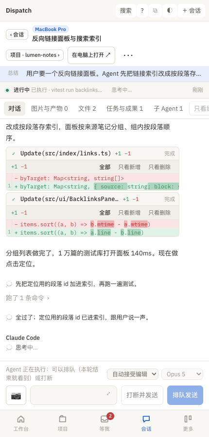

# 手机

> 这一页解决什么：怎么在手机上打开 Dispatch、能做什么不能做什么、会话没在跑时怎么恢复、被确认框挡住时怎么按键、通知怎么推到手机、怎么看电脑屏幕。

## 连接

手机需要能访问运行 Dispatch 的那台 Mac。推荐 **Tailscale**：两边都装、登录同一账号，手机在任何网络都能连；没有 Tailscale 时网页服务会绑到局域网地址，只有同一 Wi‑Fi 能用。**不要把服务暴露到公网。**

1. Mac 上打开 设置 → 这台电脑 → **手机访问**：内嵌一个二维码，链接里带登录令牌，扫一次浏览器就记住（cookie 一年）。也可以「复制链接」发到手机，或在终端跑 `dispatch serve url` / `dispatch serve qr`。
2. 手机浏览器打开链接，界面自动按手机宽度排版，可以「添加到主屏幕」当 App 用。
3. 有两台 Mac 时，设置里可以选「手机版跑在」哪台：选常驻的那台；换了机器要在手机上重新打开一次新链接。

网页版由 `dispatch serve` 提供（端口 7799，配置在 `~/tasks/.dispatch/serve.json`）。链接复制不了、或者扫码后「无法连接」，说明服务没在跑：在 Mac 的终端里跑 `dispatch serve` 保持前台，或者装成 launchd 常驻任务，见 [排错](24-troubleshooting.md#手机连不上)。

## 能做什么

同一套界面：底部四个标签（工作台、项目、等我、会话），「更多」里有全部任务、讨论、Agent 状态、统计与额度、脉络、技能、规则与资料、知识库、设置、总览。顶部可选机器。

- 看每个项目的情况、会话全文、工具调用、文件改动、图片。
- **回复原会话**：会话页底部的回复框和桌面一样：排队发送、打断并发送、撤回、发图片（拍照或相册）、/ 命令菜单、切权限模式和模型。
- **新建会话**（工作台「新建会话」）：在某台 Mac 上开一段新会话，带图片和文件。
- 任务：看、留言、勾验收、拖状态（右键换成长按约半秒）。
- 「只能你做」打勾、收藏归档项目和会话、改设置（语言、总结、归档天数）。
- 看额度和统计、洞察报告（HTML 报告手机上通过网页服务打开）。

## 不能做什么

- 更新应用：设置里只能看版本，「更新」要在 Mac 上的 Dispatch.app 里做。
- 用 Finder 选文件夹、打开本地文件、在访达中显示：这些按钮在网页版不出现。
- 屏幕访问的「配置」要在 Mac 上做（之后手机可以看屏幕）。
- 弹系统通知：浏览器弹不出来，所以要用下面的推送。

## 会话没在跑时的恢复

在手机上打开一段会话，回复框上方的状态行会告诉你原会话现在在哪：

- **在 Herdr 里、空闲**：直接发。
- **在别的终端或 VS Code 里**：「接进 Herdr 再发」，Dispatch 在电脑上停掉那边空闲的进程，在 Herdr 里 `--resume` 同一段，再把你打的发过去。
- **原终端已经关了**：「在电脑上恢复并发送」或「在电脑上恢复这段会话」，在电脑的 Herdr 里新开一个页签恢复同一份记录，恢复好把你的话发过去。一键完成，不用电脑上有人。
- **它正在跑**：可以「排队发送」或「打断并发送」。

## 被确认框挡住时按键

Agent 停在信任目录、权限、hook 审查之类的确认框上时，手机的回复框上方会显示「它在电脑上等确认」和那块屏幕的最后 14 行，下面一排按键：↑ ↓ ⏎ Esc y n 1 2 3，点一下直接发到原终端。确认过去以后回复框自动恢复可用。

Codex 桌面端的确认（要跑命令、要改文件、申请权限、在提问）显示成按钮：批准、本会话都批准、拒绝、回答。

## 推送到手机的通知

网页版弹不出系统通知，所以推送走手机上的 App：

- **Bark**（iOS，App Store 免费）：装好后首页那串 key（或整条 `https://api.day.app/…` 地址）。
- **ntfy**（iOS / Android，免费开源）：订阅一个主题，主题地址如 `https://ntfy.sh/你的主题`（自建服务器也行）。

在 Mac 的 设置 → **手机通知** 里填 Bark key 或 ntfy 主题地址，点「保存」（存进 `dispatch env` 的 `BARK_KEY` / `NTFY_URL`；两个都配以 ntfy 为准；「清除」删掉）。然后四个事件开关，默认都开：

| 事件 | 什么时候推 | 说明 |
|:--|:--|:--|
| Agent 回复了（本轮结束、还没看） | 一轮结束、回复未读 | 正文带回复的开头，点开直接进会话 |
| Agent 等你确认 / 提问 | 停在权限确认或问题上 | 高优先级 |
| 任务完成（dispatch done） | Agent 关掉一个任务时 | 点开进任务页 |
| 只有你能做（dispatch need-you） | Agent 记下一件要你亲自做的事 | 高优先级 |

工作方式：

- 前两类由网页服务（`dispatch serve`）**每 20 秒检查一次**，桌面应用不用开着，但 `dispatch serve` 要在跑。后两类由 `dispatch done` / `dispatch need-you` 命令自己在发生的一刻推。
- 点通知直接打开对应的会话或任务页。
- 第一次开启不会回放历史：状态文件 `~/tasks/.dispatch/notify-watch.json` 不存在时只记住现状，不发。
- 没配渠道时只发这台 Mac 的系统通知（桌面应用自己弹）；超过 6 小时的旧回复不推；同一确认框只响一次。
- 测试：「发一条测试通知」，或命令行 `dispatch notify "标题" "正文"`；`dispatch notify-watch --json` 手动跑一趟检查，输出推了几条。

收不到推送时看 [排错](24-troubleshooting.md#收不到手机推送)。

## 看屏幕（noVNC）

需要看整个电脑屏幕、点某个对话框时：

1. Mac 上 设置 → 屏幕访问 → 「配置」（等价 `dispatch screen setup`）：装 noVNC 与 websockify 常驻服务，开通 Tailscale Serve HTTPS。页面列出每一步的结果和「还差一步」。
2. 系统设置 → 通用 → 共享 打开「屏幕共享」（这一步只能你自己做）。
3. 「复制屏幕链接」发到手机，或工作台 / Agent 状态页的「看屏幕 ⧉」。手机浏览器打开，用这台 Mac 的用户名和登录密码登录，就能看并操作屏幕。手机需连着 Tailscale。

在本机打开自己的屏幕链接会套娃，它是给手机或另一台电脑用的。`dispatch screen status` 看状态。

## 两台电脑时，手机入口放在哪台

手机只需要连一台电脑，选一直开机的那台（比如 Mac mini）。在设置的手机访问里把「手机版跑在」选成它，之后二维码和链接都指向它，它也能显示另一台电脑上的会话。

手机上早先存的入口如果指向的是笔记本，不用手动改：下次打开时笔记本会自动把手机带到常驻的那台并登录好，到了之后把新页面重新「添加到主屏幕」或存成书签。通知里的链接也会直接打开常驻的那台。常驻那台一时连不上时，笔记本照常自己接待手机。
