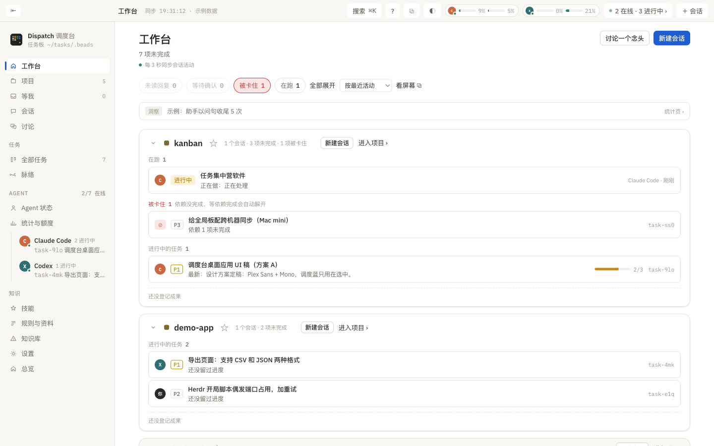

# Arbeitsplatz

> Worum es auf dieser Seite geht: Der Arbeitsplatz ist die erste Seite, die Sie beim Öffnen von Dispatch sehen, und beantwortet die Frage „Wie steht es gerade um jedes Projekt?“. Hier steht, was jede Zeile und jede Schaltfläche bedeutet und wie Sie die Seite so einstellen, dass sie Ihnen entgegenkommt.

## Aufbau der Seite

Von oben nach unten:

1. **Titelzeile**: „Arbeitsplatz“ und „N offen“; die kleine Zeile darunter zeigt den Verbindungszustand: „Sitzungsaktivität wird alle 3 Sekunden synchronisiert“, bei einer Unterbrechung „Aktualisierung unterbrochen · Verbindung wird wiederhergestellt“, und wenn der andere Rechner nicht erreichbar ist „<Rechner> vorübergehend nicht erreichbar“. Rechts zwei Schaltflächen: „Eine Idee besprechen“ (siehe [Übersicht und Diskussionen](15-overview.md)) und „Neue Sitzung“.
2. **Zählerleiste**: vier anklickbare Zähler; ein Klick zeigt nur die betreffenden Projekte, ein weiterer hebt die Auswahl auf:
   - **Ungelesene Antwort**: Sitzungen, in denen der Agent fertig ist und darauf wartet, dass Sie es sehen.
   - **Wartet auf Bestätigung**: Sitzungen, die an einem Bestätigungsdialog stehen.
   - **Blockiert**: Aufgaben mit offenen Abhängigkeiten.
   - **Läuft**: Sitzungen, die gerade arbeiten.
   Rechts daneben: „Alle ausklappen / Alle einklappen“, die Sortierung der Projekte (nach letzter Aktivität, nach Anzahl Sitzungen, nach offenen Aufgaben, nach Name; Favoriten stehen immer vorn), „Zugriff vom Handy ⧉“ (kopiert den Handy-Link) und „Bildschirm ansehen ⧉“ (nur anklickbar, wenn der Bildschirmzugriff eingerichtet ist).
3. **Zeile mit Erkenntnissen** (falls vorhanden): ein Satz aus dem agentenübergreifenden Rückblick der letzten 14 Tage, mit einem Zähler „N neu“ für Hinweise; ein Klick führt in den Abschnitt Erkenntnisse der Statistikseite.
4. **Verfolgt**: Ihre als Favorit markierten Sitzungen, projektübergreifend hier gesammelt, höchstens 6 Einträge.
5. **Projektkarten**: eine je Projekt.
6. **Andere Projekte**: Projekte ohne Regung in den letzten drei Tagen, auf je eine Zeile zusammengefaltet; „N ausklappen“ öffnet sie.
7. **Archiviert**: archivierte Projekte, über „Aus dem Archiv holen“ zurückzuholen.

## Eine Projektkarte

Der Kartenkopf: Pfeil zum Einklappen, Farbfeld des Projekts, Projektname (führt zur Projektseite), ☆ für Favorit, Zähler („N Sitzungen · N offen · N blockiert · N Ergebnisse“), „Neue Sitzung“, „Projekt öffnen ›“. Im eingeklappten Zustand wird der Kopf zu einigen kleinen Marken: „Wartet auf Sie N“, „Läuft N“, „Verfolgt N“, „Aufgaben N“, „Blockiert N“. Ein Klick auf „Wartet auf Sie“ springt zum Reiter Sitzungen der Projektseite, ein Klick auf „Aufgaben“ zum Rückblick.

Ausgeklappt erscheinen die folgenden Gruppen in dieser Reihenfolge (leere Gruppen werden ausgelassen, je Gruppe höchstens 3 Einträge, weitere über „Noch N Einträge, Projekt öffnen ›“ unten):

| Gruppe | Inhalt | Klick |
|:--|:--|:--|
| Wartet auf Sie | Sitzungen, die auf Bestätigung warten (die Statusmarke sagt, worauf), und ungelesene Antworten (Marke „Ungelesene Antwort“, darunter eine Zusammenfassung dieser Antwortrunde) | „Öffnen und antworten“ führt zur Sitzungsseite |
| Läuft | Sitzungen, die gerade arbeiten; „Arbeitet gerade: …“ nennt die aktuelle Tätigkeit | öffnet die Sitzungsseite |
| Verfolgt | als Favorit markierte Sitzungen (soweit nicht schon in den beiden Gruppen darüber) | öffnet die Sitzungsseite |
| Blockiert | Aufgaben im Status Blockiert, „N Abhängigkeiten offen“; sobald die Abhängigkeiten erledigt sind, lösen sie sich von selbst | öffnet die Aufgabendetails |
| Aufgaben in Arbeit | Bild der zuständigen Person, Priorität, Titel; darunter „Zuletzt: <Fortschritt>“ oder „Als Nächstes: <Abnahmekriterium>“, rechts der Fortschrittsbalken der Abnahme | öffnet die Aufgabendetails |
| Letzte Sitzung | erscheint, wenn im Projekt gerade nichts los ist, und zeigt die letzte Sitzung | öffnet die Sitzungsseite |

Am unteren Rand der Karte: „Neuestes Ergebnis · <Titel> ›“ (sonst „Noch kein Ergebnis erfasst“).

Welche Karten sind vorab ausgeklappt: die ersten Projekte bis zu der in den Einstellungen festgelegten Zahl („Wie viele Projekte vorab ausklappen“, voreingestellt 2) sowie alle mit Inhalt unter „Wartet auf Sie“. Sobald Sie selbst ein- oder ausklappen, gilt Ihre Entscheidung.

## Rechtsklick

- Auf einen Projektnamen oder eine Karte: Projekt öffnen, in neuem Fenster öffnen, neue Sitzung in diesem Projekt, nur seine Aufgaben zeigen, zu Favoriten hinzufügen bzw. Markierung entfernen, archivieren bzw. aus dem Archiv holen.
- Auf eine Sitzungszeile: Öffnen und antworten, in neuem Fenster öffnen, Sitzung im Terminal öffnen, als gelesen bzw. als ungelesen markieren, zu Favoriten hinzufügen (langfristig verfolgen), archivieren, als geplante Sitzung markieren, umbenennen, Projekt zuordnen, diese Sitzung mit einem Modell zusammenfassen, Fortsetzungsbefehl kopieren, auf den anderen Mac verschieben.
- Auf eine Aufgabenzeile: Aufgabendetails öffnen, in neuem Fenster öffnen, Aufgaben-ID kopieren, Aufgabeninhalt kopieren, an einen Agenten vergeben, nach Offen bzw. In Arbeit verschieben, als erledigt markieren, in den Papierkorb verschieben.
- Auf eine leere Stelle: die Aktionen dieser Seite (Alle ausklappen / einklappen) zuzüglich der globalen Aktionen (Neue Sitzung ⌘N, Neue Aufgabe ⌘T, Aktualisieren ⌘R, Suchen ⌘K, Link für den Zugriff vom Handy kopieren).

Mit <kbd>⌘</kbd> plus Klick öffnen Sie alles, was ein Projekt, eine Sitzung oder eine Aufgabe darstellt, in einem neuen Fenster.

## Kopfleiste und Seitenleiste

- Links oben steht der Pfad: der Name der aktuellen Seite; nach dem Öffnen eines Projekts oder einer Sitzung gibt es Schaltflächen wie „‹ Zurück zum Arbeitsplatz“, die eine Seite zurückführen.
- Rechts oben: „Suchen ⌘K“, die Kontingentbalken der Agenten (der Verbrauch auf diesem Rechner, die Reset-Zeit erscheint beim Überfahren), „＋ Sitzung“, Umschalter für das Erscheinungsbild und ⧉ „Ablösen“ (verschiebt die aktuelle Seite in ein eigenes Fenster, das ursprüngliche Fenster kehrt zur vorherigen Seite zurück).
- Seitenleiste: Arbeitsplatz, Projekte, Wartet auf mich (die rote Zahl ist die Summe aus ungelesenen Antworten, Wartet auf Bestätigung und Nur Sie können), Sitzungen, Diskussionen; die Gruppe Aufgaben (Alle Aufgaben, Verlauf); die Gruppe Agent (Agent-Status, Statistik & Kontingent, darunter die Agenten, die gerade online sind, und die auf sie laufenden Aufgaben); die Gruppe Wissen (Skills, Regeln & Unterlagen, Wissensbasis, Einstellungen, Übersicht). Bei zwei Rechnern kommt oben in der Seitenleiste eine Zeile mit dem Filter „Alle / Rechnername“ hinzu.
- Symbol in der Menüleiste: zeigt „Ungelesene ●● Laufende“; ein Klick öffnet die Zähler für Wartet auf Sie, Wartet auf Agent-Prüfung und Offen sowie die Kontingente der Agenten.

## Wenn es noch kein Projekt gibt

„Noch keine Projekte. Sitzungen werden über ihr Arbeitsverzeichnis einem Projekt zugeordnet, Aufgaben über die Marke `project:Name`.“ Öffnen Sie zunächst eine Sitzung im Terminal oder klicken Sie auf „Neue Sitzung ›“. Läuft eine Sitzung nachweislich, taucht aber nicht auf, prüfen Sie Einstellungen → Projekte → Arbeitsbereich-Ordner sowie die [Fehlerbehebung](24-troubleshooting.md#sitzungen-werden-nicht-gelesen).
