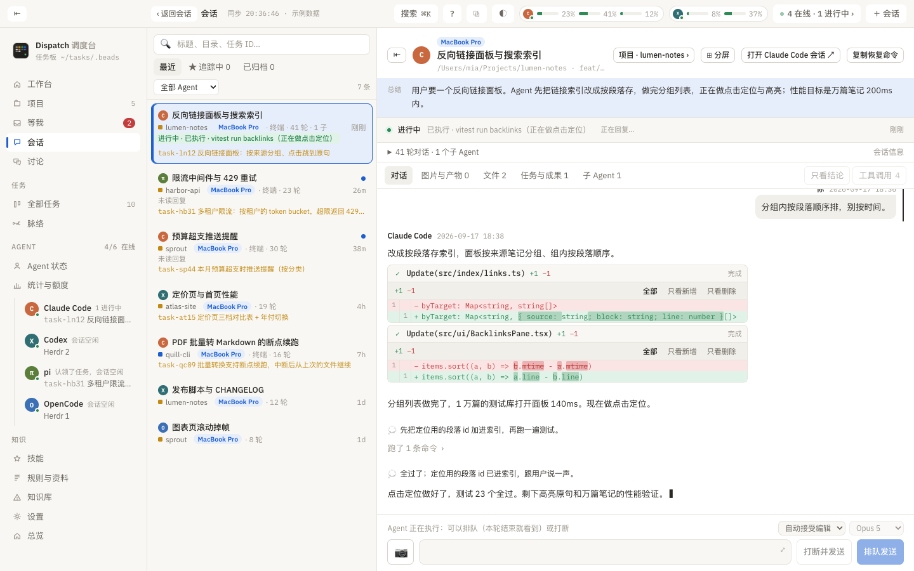
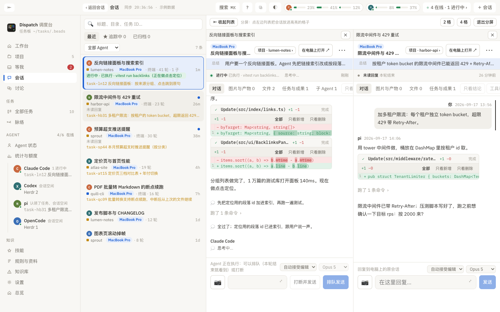

# Sitzungsseite

> Worum es auf dieser Seite geht: Auf der Sitzungsseite sehen Sie jeden Schritt des Agenten und antworten ihm direkt. Hier steht, wie Sie die Liste filtern, was jeder Reiter der Sitzungsdetails enthält, was jede Schaltfläche des Antwortfelds tut (einreihen, unterbrechen, zurücknehmen, fortsetzen, in Herdr übernehmen, Tasten für Bestätigungsdialoge) und wie geteilte Ansicht, abgelöstes Fenster und Zurückgehen funktionieren.

## Links: die Sitzungsliste

- Suchfeld: Titel, Ordner, Aufgaben-ID, Anfang der Sitzungs-ID.
- Vier Modi: **Zuletzt** (Voreinstellung), **★ Verfolgt** (Favoriten, langfristig verfolgt, werden nicht automatisch archiviert), **Archiviert** (von Hand archiviert oder länger ohne Aktivität als in den Einstellungen festgelegt) und **Geplant oder per Skript** (zeitgesteuerte Aufgaben, Skripte oder von einem anderen Agenten über eine Programmierschnittstelle gestartet; erscheint nur, wenn es solche gibt).
- Filter nach Agent: Alle, Claude Code, Codex, pi, ZCode, OpenCode, Hermes. Rechts steht die Anzahl im aktuellen Filter.
- Jede Zeile: Bild, ★, Titel (laufende Sitzungen grün hervorgehoben; fertige, noch ungelesene mit blauem Punkt; Sitzungen, die nicht im Index von Dispatch stehen, deren Prozess aber noch lebt, tragen „Läuft / offen“), Farbfeld und Name des Projekts, dieser Mac bzw. Rechnername, „verschoben nach / verschoben von …“, Ursprung (Terminal, Desktop-App, VS Code, SDK und so weiter), „N Runden“ Gespräch, Anzahl der Subagenten und die Zeit; darunter die aktuelle Tätigkeit oder der jüngste Fortschritt und darunter die verknüpften offenen Aufgaben.
- Vereinzelte Sitzungen ohne Titel und mit höchstens einem Satz rutschen nach unten unter „Vereinzelte Sitzungen“.
- Beim ersten Öffnen muss die gesamte Historie gelesen werden, dazu erscheint „Wird indexiert …“; danach öffnet sich eine bereits gesehene Sitzung sofort und nur der Zuwachs wird nachgeladen.

Über „⇤ Liste einklappen“ nimmt das Gespräch die ganze Seite ein (je Gerät gemerkt).

## Rechts: eine Sitzung

### Kopfbereich

„‹ Sitzungen“ oder „‹ Zurück zu <vorherige Seite>“, Bild, dieser Mac bzw. Rechnername, Titel, `Ordner · Branch · Sitzungs-ID`; rechts: „Projekt · <Name> ›“ zurück zur Projektseite, „⊞ Geteilte Ansicht“, „In Herdr“ (wenn die Sitzung in einem anderen Terminal läuft), „<Agent>-Sitzung öffnen ↗“ (öffnet oder setzt sie im ursprünglichen Agenten auf jenem Rechner fort), „Fortsetzungsbefehl kopieren“ (im Terminal einfügen, Eingabetaste, weiter geht es) und das Menü ⋯.

Unter dem Kopfbereich:

- **Zusammenfassung** (falls vorhanden): ein vom Modell geschriebener Absatz zu Ziel, Getanem und noch Fehlendem; am Handy standardmäßig auf eine Zeile gefaltet, zum Öffnen antippen.
- **Zeile mit dem Live-Status**: Ein grüner Punkt zeigt an, dass die Sitzung läuft; der Text nennt den aktuellen Zustand („Ruft Bash auf …“, „Antwortet …“, „Denkt nach …“) und den Zeitpunkt der letzten Aktivität. Bei unterbrochener Verbindung steht dort „Aktualisierung unterbrochen, letzter Stand bleibt erhalten“.
- **Sitzungsinformationen** (eingeklappt): Beginn, letzter Zeitpunkt, Ursprung, Anzahl der Runden, Antworten und die Größe, Statistik der Werkzeugaufrufe, Liste der Subagenten.

### Reiter

| Reiter | Inhalt |
|:--|:--|
| Unterhaltung | Die Chronik. Ihre Nachrichten, die Überlegungen des Agenten (eingeklappt, zum Volltext aufklappen), Karten für Werkzeugaufrufe (Name, wichtigste Parameter, Status ✓ ✗ …; aufgeklappt sehen Sie alle Parameter und die Ausgabe; bearbeitende Werkzeuge erscheinen als Diff der Form `Update(Pfad) +N −M`, kleine Änderungen sind vorab ausgeklappt), aufeinanderfolgende Werkzeugaufrufe zu einer Zeile „N Befehle ausgeführt ›“ gefaltet, eingebettete Bilder und Systemereignisse (Subagent fertig, Hook-Meldung). Während die Sitzung läuft, wird alle 1,5 Sekunden der Zuwachs geholt und automatisch nach unten gescrollt; sobald Sie nach oben scrollen, endet das Mitlaufen und rechts unten erscheint „Zum Neuesten ↓“. Rechts oben zwei Schalter: „Nur Ergebnisse“ (zeigt nur Ihre Fragen und die letzte Antwort jeder Runde) und „Werkzeugaufrufe“ (blendet die Werkzeugkarten ein oder aus; gerade laufende erscheinen immer). |
| Bilder & Artefakte | Die in dieser Sitzung angehängten oder erzeugten Bilder, PDFs, HTML-Dateien, Audio- und Videodateien und Texte, gesammelt zur Vorschau. HTML wird in einem abgeschotteten iframe angezeigt, der Netzwerkzugriff nach außen ist gesperrt. Höchstens 20 MB je Datei. |
| Dateien | „In dieser Sitzung geänderte Dateien“: jede Änderung, die aus einem bearbeitenden Werkzeugaufruf hervorgeht, nach Datei gefaltet und mit Diff. Dateien, die über Terminalbefehle geändert wurden, stehen nicht hier; der eingeklappte Bereich „Aktuelle Git-Änderungen im Ordner“ darunter zeigt alle nicht übernommenen Unterschiede des gesamten Arbeitsbereichs (die Änderungen aller Sitzungen desselben Ordners, nicht nur dieser einen), je Datei mit aufklappbarem Patch, ab 100 KB abgeschnitten. Der Rechtsklick auf eine Datei bietet Öffnen, im Finder zeigen und Pfad kopieren. |
| Aufgaben & Ergebnisse | Die mit dieser Sitzung ausdrücklich verknüpften Aufgaben (auslösend bzw. beteiligt) und Ergebnisse; „Im Gespräch wurden weitere N Aufgaben erwähnt“ ist nur ein Hinweis und begründet keine Zugehörigkeit. |
| Subagent | Die von dieser Sitzung ausgesandten Subagenten; jeder ist ein eigenes Gespräch, aufgeklappt sehen Sie dessen vollständige Aufzeichnung und die geänderten Dateien. „Auslösende Aufrufe“ listet die Werkzeugaufrufe auf, die sie ausgesandt haben. |

### Antwortfeld

Ganz unten steht immer das Antwortfeld; die Statuszeile nennt den Verbindungszustand:

- „Verbindung zur Ursprungssitzung wird aufgebaut …“ → nach dem Verbinden steht dort, wo die Ursprungssitzung liegt (Herdr-Tab, Codex-Desktop-App und so weiter).
- Besteht die Verbindung und handelt es sich um Claude Code, lassen sich der **Berechtigungsmodus** (Jedes Mal fragen, Änderungen automatisch übernehmen, Planungsmodus, Berechtigungen überspringen; entspricht Shift+Tab im Terminal) und das **Modell** umschalten (entspricht `/model`, während die Sitzung läuft nicht umschaltbar).

Eingabe:

- Einfach tippen; <kbd>⌘⏎</kbd> sendet; ⤢ vergrößert das Eingabefeld. Entwürfe werden je Sitzung gesichert.
- Die Eingabe von `/` öffnet ein Menü der verfügbaren Befehle (eingebaute Befehle, Skills, eigene Befehle); mit ↑↓ wählen, mit ⏎ oder Tab einfügen.
- 📷 Bild senden: Am Handy fotografieren oder aus dem Album wählen, am Rechner direkt einfügen. Die Bilder werden auf dem Rechner abgelegt, auf dem die Sitzung läuft; Claude Code erhält sie als Anhang, andere Agenten erhalten den Pfad. Große Bilder werden auf höchstens 2000 Pixel verkleinert.
- Die Beschriftung der Sendeschaltfläche richtet sich nach dem Zustand: **Senden** (untätig), **In Warteschlange senden** (läuft gerade: die Nachricht wird eingereiht und der Agent sieht sie am Ende dieser Runde), **Zustellung prüfen** (für die letzte Sendung kam keine Bestätigung).
- **Unterbrechen und senden** (erscheint, während die Sitzung läuft): unterbricht die laufende Runde zuerst mit Esc und schickt dann Ihre Nachricht.

Nach dem Senden:

- Angenommene Nachrichten erscheinen über dem Feld als „Sie · <Vermerk>“ samt Text; bei mehreren steht dort „N in der Warteschlange, werden nach dieser Runde der Reihe nach bearbeitet“. Sobald die Nachricht im Gespräch auftaucht, verschwindet diese Zeile.
- Bei Claude Code lässt sich die letzte noch in der Warteschlange stehende Nachricht **Zurücknehmen** (zurückholen und nicht senden) oder **Zurücknehmen und bearbeiten** (zurück ins Eingabefeld, ändern und erneut senden).
- Ist die Zustellung unsicher, erscheinen „Zustellung prüfen“ und „Geprüft, weiter bearbeiten“; wiederholtes Klicken auf Senden erzeugt keine zweite Nachricht, dieselbe Nachricht geht genau einmal hinaus.

Läuft die Ursprungssitzung nicht oder liegt sie nicht in Herdr, bietet die Statuszeile die passende Schaltfläche:

- **In Herdr übernehmen und senden**: Die Sitzung läuft in Warp, iTerm, Terminal oder der VS-Code-Erweiterung. Der dort untätige Prozess wird beendet, in Herdr auf jenem Rechner wird dasselbe Gespräch mit `--resume` fortgesetzt, und dann geht Ihre Nachricht hinaus. Ist eine Sitzung aus der VS-Code-Erweiterung einmal übernommen, müssen Sie sie in VS Code erneut fortsetzen, um dort weiterzuarbeiten. Während sie läuft, ist die Schaltfläche nicht anklickbar; warten Sie, bis sie anhält.
- **Auf dem Mac fortsetzen und senden** bzw. **Diese Sitzung auf dem Mac fortsetzen**: Das ursprüngliche Terminal ist bereits geschlossen. In Herdr auf dem Rechner wird ein neuer Tab geöffnet, der dieselbe Aufzeichnung fortsetzt, und danach geht Ihre Nachricht hinaus. Am Handy erledigt das ein Fingertipp.
- **Neu verbinden**: prüft es noch einmal.

Steht der Agent an einem Bestätigungsdialog (vertrauenswürdiges Verzeichnis, Berechtigungen, Hook-Prüfung und so weiter):

- Terminalsitzungen von Claude Code, pi oder Codex: Über dem Antwortfeld erscheinen „Wartet auf dem Mac auf eine Bestätigung“ und die letzten 14 Zeilen jenes Bildschirms, darunter eine Reihe Tasten ↑ ↓ ⏎ Esc y n 1 2 3, die direkt an das ursprüngliche Terminal gehen.
- Codex-Desktop-App: Es wird angezeigt, worauf gewartet wird (ein Befehl soll laufen, eine Datei soll geändert werden, eine Berechtigung wird angefragt, eine Frage steht im Raum, Sie sollen wählen). Sie können „Erlauben“, „Für diese Sitzung immer erlauben“ oder „Ablehnen“ wählen; auf Fragen antworten Sie über die Auswahl oder mit eigenem Text und dann „Antworten“. Der Fall „Sie sollen wählen“ und MCP-Anfragen müssen in der Desktop-App selbst bearbeitet werden. Während sie läuft, gibt es „Unterbrechen“.

Die Grenzen des Antwortens: Zugestellt wird nur an die Ursprungssitzung auf dem gewählten Rechner; das Herdr-Terminal muss zugleich Sitzungs-ID und Vordergrundprozess treffen; während einer laufenden Ausführung oder einer offenen Berechtigungsabfrage wird nichts in die Eingabe geschrieben. Die Sendebestätigungen liegen lokal in `~/tasks/.dispatch/reply-receipts.sqlite` und werden nicht auf den anderen Rechner kopiert.

## Geteilte Ansicht, abgelöstes Fenster, neues Fenster

- **⊞ Geteilte Ansicht**: Die aktuelle Sitzung kommt nach links, danach wählen Sie aus der Liste eine weitere Sitzung für das hervorgehobene Feld; „2 Felder“ und „4 Felder“ schalten um; jedes Feld ist eine eigenständige Sitzungsseite (mit eigener Aufzeichnung, eigenem Antwortfeld und eigenem Abruf), ✕ schließt ein Feld und „Geteilte Ansicht verlassen“ führt zur Einzelseite zurück.
- **⧉ Ablösen** (in der Kopfleiste): verschiebt die aktuelle Seite in ein eigenes Fenster; das ursprüngliche Fenster kehrt zur vorherigen Seite oder zum zugehörigen Projekt zurück.
- **Rechtsklick → In neuem Fenster öffnen**, oder <kbd>⌘</kbd> plus Klick auf ein Projekt, eine Sitzung oder eine Aufgabe: öffnet direkt ein neues Fenster.
- **Zurück**: die Schaltfläche „‹ Zurück zu <vorherige Seite>“ in der Kopfleiste oder „‹ Sitzungen“ im Kopfbereich der Sitzung. Wer vom Arbeitsplatz kam, kehrt zum Arbeitsplatz zurück, wer vom Projekt kam, zum Projekt; die Scrollposition wird gemerkt.

## Kontextmenü (Sitzung)

Öffnen und antworten, in neuem Fenster öffnen, Sitzung im Terminal öffnen, als gelesen bzw. als ungelesen markieren (kehrt in „Wartet auf mich“ zurück, um sie später anzusehen), zu Favoriten hinzufügen: langfristig verfolgen bzw. Markierung entfernen, archivieren bzw. aus dem Archiv holen (wird zu Verfolgt), als geplante Sitzung markieren bzw. zur normalen Sitzung zurücksetzen, umbenennen … (ändert nur den in Dispatch angezeigten Namen), Projekt zuordnen … (danach wird dieser Projektname angezeigt, der Arbeitsordner wird nicht verschoben), diese Sitzung mit einem Modell zusammenfassen bzw. neu zusammenfassen, Fortsetzungsbefehl kopieren, Vergeben, nach <Rechner> verschieben und dort weiterarbeiten. Wenn der Rechtsklick ungelegen kommt, klicken Sie am Zeilenende auf „Mehr“.

## Neue Sitzung (⌘N)

Sie wählen den Rechner, auf dem sie laufen soll (nicht erreichbare sind nicht wählbar), den Agenten (einen, dessen Gespräch Sie in Dispatch sehen und beantworten können: Claude Code, Codex, pi, OpenCode, Hermes), den Arbeitsordner (Pfad eintippen, im Finder auswählen oder unten durchblättern, mit einer Liste der zuletzt verwendeten) und die erste Nachricht (Bilder lassen sich einfügen, 📷 fügt Bilder hinzu, 📎 Dateien; beides wird auf dem ausführenden Rechner abgelegt und vom Agenten mit Read gelesen). Nach „Erstellen und senden“ startet der Agent in Herdr auf dem gewählten Rechner und übernimmt die vorhandenen Anmeldungen und Berechtigungseinstellungen; lokal wechselt die Ansicht in das Terminal mit Herdr, Sie können aber ebenso gut in Dispatch bleiben und den Fortschritt verfolgen.
