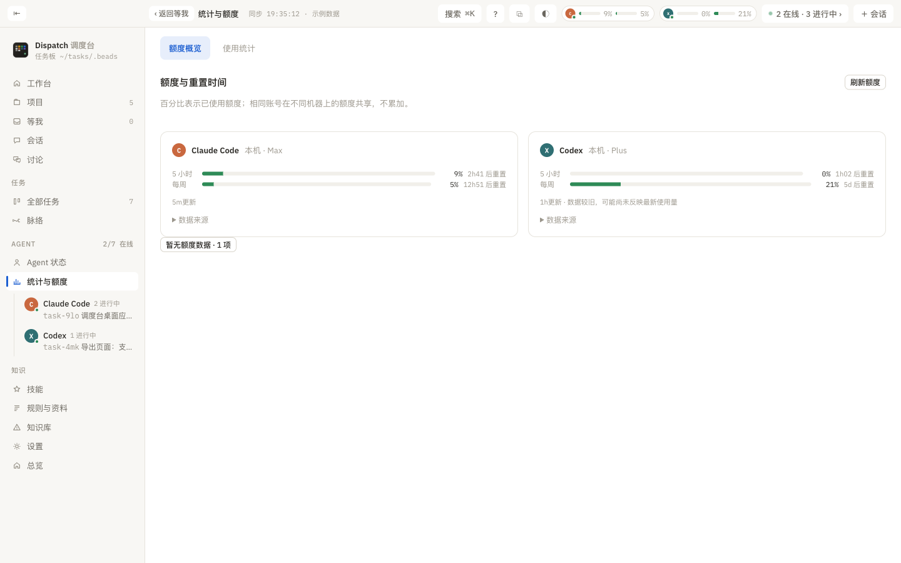

# Statistik & Kontingent

> Worum es auf dieser Seite geht: wie viel Kontingent jeder Agent verbraucht hat und wann es zurückgesetzt wird; wie sich der bisherige Verbrauch nach Token, Nachrichten, Werkzeugen, Modellen und Projekten verteilt; und wo der agentenübergreifende Rückblick mit seinen Erkenntnissen steht.

Erreichbar über „Statistik & Kontingent“ in der Seitenleiste; oben auf der Seite stehen zwei Reiter: **Kontingent** und **Nutzungsstatistik**. Welchen Sie zuletzt gewählt haben, merkt sich jedes Gerät. Filtert die Seitenleiste nach einem Rechner, wird hier nur dieser Rechner gerechnet.

## Kontingent

Jeder Agent bekommt eine Karte: Bild, Name, Rechner (dasselbe Konto auf zwei Rechnern erscheint als „+ &lt;Rechner&gt; · dasselbe Konto“), Tarif (Pro, Max, Plus, Team und so weiter) und darunter die Verbrauchsbalken der einzelnen Zeitfenster: Bezeichnung (etwa 5 Stunden, 7 Tage, ein bestimmtes Modell), verbrauchter Anteil in Prozent und „Reset in N h“. Ab 70 % wird der Balken gelb, ab 90 % rot. Am unteren Rand der Karte stehen der Aktualisierungszeitpunkt (nach mehr als 10 Minuten folgt der Hinweis, dass die Daten älter sind) und der eingeklappte Bereich „Datenquelle“.

- Der Prozentsatz zeigt den **verbrauchten** Anteil; ein Konto teilt sich ein Kontingent über alle Rechner, es summiert sich nicht. Passen die Zahlen auf beiden Seiten nicht zusammen, erscheint der Hinweis „Auf &lt;Rechner&gt; ist das nicht dasselbe Konto“; möglich ist auch, dass einer der beiden Datensätze veraltet ist.
- Datenquellen: Claude Code nutzt die offizielle Verbrauchsschnittstelle (liest die lokale Anmeldung, nur lesend und ohne Weitergabe), Codex und ZCode lesen ihren jeweiligen lokalen Zustand. Fehlende oder veraltete Werte werden als solche ausgewiesen und nicht auf null geschätzt.
- „Kontingent aktualisieren“ liest neu ein; „Keine Kontingentdaten · N“ klappt die Agenten auf, für die nichts vorliegt.
- In der Kopfleiste und im Symbol der Menüleiste erscheinen genau diese Werte für diesen Rechner.

## Nutzungsstatistik

Die Werkzeugleiste: nach Agent (alle oder einzeln), Zeitraum (7 Tage, 30 Tage, 90 Tage, ein Jahr, alles) und nach Token oder nach Nachrichten. Gibt es zwei Rechner und ist kein Filter gesetzt, steht dort „A + B“, das heißt, die Zahlen beider Rechner sind addiert.

Der Inhalt von oben nach unten:

1. **Karte mit den Erkenntnissen** (siehe unten).
2. **Vier Zahlen**: Token insgesamt (Eingabe, Ausgabe, Cache gelesen, Cache geschrieben, Nachdenken), Anzahl der Nachrichten (Anzahl der Sitzungen, Anteil der Subagenten), aktive Tage (aktuelle Serie, längste Serie) und Arten von Werkzeugen (Anzahl der aktiven Zeitabschnitte oder das Anfangsdatum).
3. **Wer verbraucht**: Balken mit dem Token-Anteil je Agent.
4. **Aktivitäts-Heatmap**: ein Kalender im Stil von GitHub, wobei die Farbtiefe die Token oder Nachrichten des Tages darstellt.
5. **Wann gearbeitet wird**: ein Raster aus Wochentagen und Stunden, das die geschäftigsten Zeitabschnitte benennt.
6. **Letzte N Tage**: ein Säulendiagramm je Tag, nach Agent gestapelt.
7. Ranglisten: meistgenutzte Werkzeuge, Modelle (nach Antworten), meistgenutzte Skills (das Skill-Werkzeug oder Befehle mit /), ausgesandte Subagenten und Projekte, geordnet nach Token-Verbrauch.

Die Token-Zahlen stammen aus den Aufzeichnungen der Agenten selbst: bei Claude Code die usage jeder API-Antwort (nach requestId entdoppelt), bei Codex der kumulierte token_count je Runde und bei ZCode die tokens je Nachricht. Ein Geldbetrag wird hier nicht ausgewiesen; Sie haben ein Abo, dafür genügt die Kontingentseite. Beim ersten Öffnen muss der gesamte Gesprächsverlauf indexiert werden, das kann eine Minute dauern.

## Erkenntnisse

Die Karte oben auf der Statistikseite ist ein agentenübergreifender Rückblick, entspricht also dem /insights von Claude Code, deckt aber die Sitzungen aller Agenten ab:

- **Bericht**: ein vom Modell geschriebener Bericht (letzte N Tage), in Abschnitte gegliedert und aufklappbar; „Als ganze Seite öffnen“ zeigt das HTML. Sie können ihn von Hand „erstellen“ (meist 1 bis 3 Minuten) oder alle 7, 14 beziehungsweise 30 Tage automatisch erstellen lassen; frühere Berichte lassen sich aufrufen.
- **Signalzählung**: die per Regex gezählten Verhaltenssignale: viele Korrekturen, Kontextüberlauf, Werkzeugfehler, nicht aufs Board gebracht, übermäßig lang, je Agent aufgeschlüsselt.
- **Hinweise**: Warnungen, die je Sitzung beobachtet werden; neue melden sich im Arbeitsplatz und in den Systembenachrichtigungen. „Sitzung öffnen“ springt hin, „Alle als gesehen“ markiert diesen Satz.
- **Einen Agenten zur Verbesserung schicken**: übergibt die beiden Abschnitte friction und suggestions einem Agenten, der sie als Änderungen an Regeln oder Skills umsetzt.

In der Befehlszeile: `dispatch insights` (Signale) und `dispatch insights report|list|show|open|schedule`. Welches Modell die Berichte schreibt, steht unter [Bekannte Einschränkungen](26-limits.md).
