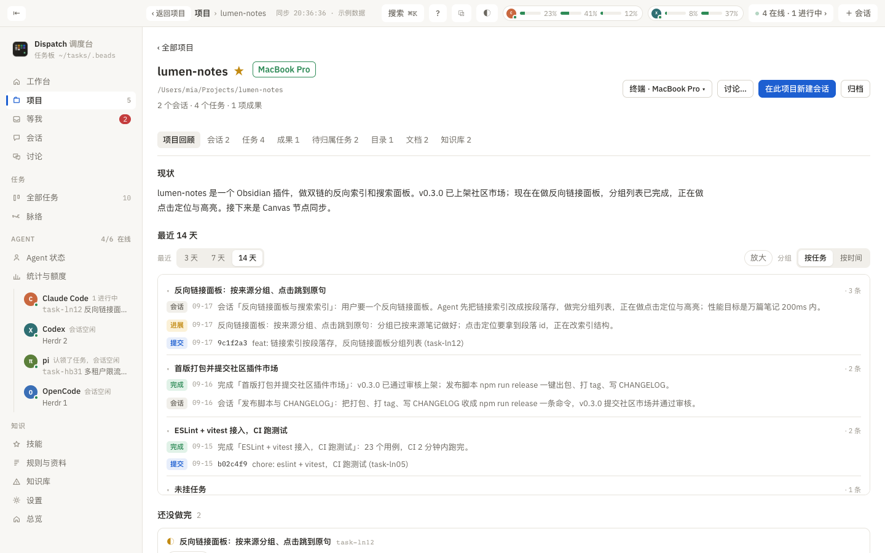

# Project page

> What this page is for: the project page is the complete record of one project. This chapter explains how to read the project list, and what each of the eight tabs inside a project (Review, Sessions, Task, Outcome, Unlinked tasks, Folder, Documents, Knowledge base) holds and lets you do.

## The project list

Reached from "Projects" in the sidebar. At the top are the search box and the sorting options (latest activity, name, session count, open tasks, Mac). Projects with activity appear as cards: display name, ☆, the Mac they are on ("The project folder is on this Mac right now" or "The project was handed to this Mac"), the unread count, a one-line summary ("In progress · &lt;task&gt;", "Latest outcome · &lt;title&gt;" or "Recent session · &lt;title&gt;"), and "N sessions · N open tasks · N outcomes". Projects with no activity for a week fold into "Quiet lately · N".

Two buttons at the bottom: "Other folders and ungrouped · N" (folders with sessions but no tasks and no outcomes) and "Archived · N". Right-clicking a project card gives you star, archive, new session and more.

## Project header

- **Title**: double-click to change the display name (the label and the folder do not change, only what is shown; leave it empty to restore). Next to it are the ☆ star, the Mac badge and the "Archived" marker.
- The line below shows the project folder and "N sessions · N tasks · N outcomes". During a move, a progress bar appears here.
- Buttons:
  - **Terminal · &lt;machine&gt; ▾**: open a terminal tab in the project folder; the menu lets you pick Claude Code, Codex or another Agent (which starts that Agent), or "Plain terminal" (no Agent).
  - **Discuss…**: take one idea about this project, let several Agents each say their piece, and reach a conclusion.
  - **Move to &lt;machine&gt;** (when you have a second Mac): hand the project folder, its Git and the sessions running here to that machine, with a pre-check before anything happens, see [Two Macs](21-two-macs.md).
  - **New session in this project**.
  - **Archive / Unarchive**.

## Tabs

### Review

The page drawn by `dispatch here <project>`, in four blocks:

1. **Where it stands**: a paragraph written by the summary model you picked in Settings (the first run may take half a minute; it is cached and rewritten automatically after a day). If summaries are off or no model is set, the reason is shown instead.
2. **Last 14 days**: a timeline. You can switch between 3 / 7 / 14 days; "Expand" drops the height limit and scrolls the whole page; "By task" groups everything belonging to one task together (progress, completion, commits and sessions, with tasks-free items in their own group), and "By date" groups by day (the latest day expanded by default, 4 items per day by default). Each row is prefixed with its type: progress, done, commit (with a 7-character hash) or session; clicking a session or task row opens it directly.
3. **Still open**: unfinished tasks, with "N/N accepted", the assignee, the time of the last progress note and the last note itself.
4. **Live sessions in this folder**: every session currently running under this folder, with its title, Agent, state (running / needs you / not registered), how many files it touched, a summary, and a verdict: "Safe to close" (click twice to confirm, which closes its Herdr tab and the process) or "Keep open" (click to see why). "Restore" reopens the session in Herdr.

### Sessions

The session list for this project, starred ones first. The search box searches titles, folders and summaries; "Archived N" switches to archived sessions (archived by hand or idle beyond the number of days in Settings); "Scheduled N" switches to sessions started by a schedule or a script. Each row: this Mac / machine name, ★, title, state chip, the "Unread turn" summary or the model summary, "You asked" (the requests you made in this session), the latest reply or progress note, "Working on", the Agent, the file-change count and the time. Below the row sit the tasks it is linked to and the "Safe to close / Keep open" verdict. Buttons on the right: "Read", "Open and reply", "✦ Summarize / Summarize again" (this calls a model) and "More" (the right-click menu).

### Task

A four-column board: **Only you can**, To do, In progress, Done (the last 7 days, with "All N ›" opening the complete list, grouped by week and searchable).

- The "Only you can" column holds the things an Agent recorded with `dispatch need-you`, each with a checkbox; tick it off when done and it closes. When empty, it explains: an Agent that hits something only you can do (send an email, pay, sign in, demo) records it here.
- Every card in the other columns shows the title, the state, and the session that started it and the sessions involved; "Pick the session" lets you choose the originating and participating sessions by hand.

### Outcome

"File an outcome" opens a form: outcome name, what was delivered and where to see it (Markdown, so you can paste documents, screenshots, versions or code links), source tasks (multiple allowed) and additional source sessions (the sessions of the tasks you picked are linked along with them). Once saved, the outcome card shows the body plus the tasks and sessions it links to; "Edit" changes it. At the bottom, "Past completion records · N" lists the completion notes of every finished task that has not yet been gathered into an outcome of its own.

### Unlinked tasks

Tasks with no explicit session link. Dispatch does not guess ownership from how often something is mentioned, so you can use "Pick the session" here.

### Folder

Which folders this project's sessions happened in, each with a session count, the latest time, and "New session here", "Show in Finder" and "Copy cd".

### Documents

The top half is **Facts**: the `FACTS.md` in the project folder, holding short facts that belong to this project alone (server entry points, how to sign in, who to ask). Agents do not load them every time, only on demand with `dispatch facts get -P <project> <topic>`. If there is none, "Create one" (with a template); if there is, "Edit"; remember to commit after saving. Below that are the names and purposes of the keys filed under this project (the values live under "Rules & docs → Keys and APIs"), each with "Copy lookup command".

The bottom half is the **document list**: it scans the project's `design/`, `docs/` and `研究/` folders for `.md` and `.html`, plus any path or URL you registered (`dispatch docs add`). The types are research, review, design, document and other. Markdown is read inside the app (images with relative paths render too), HTML opens in the default app, and a URL opens the link. A document on the other Mac is labeled with that machine's name, and only Markdown can be read there for now.

### Knowledge base

The knowledge entries carrying this project's name: pitfalls, wins, retros and how-tos, filterable by type and searchable. When empty, it suggests that Agents record entries with `dispatch wiki add --kind pit/win -P <project>`. For the global view, see [Knowledge base](13-wiki.md).
